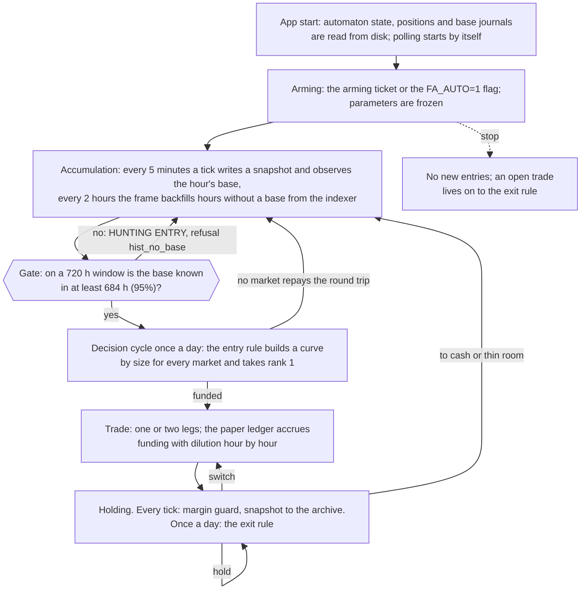
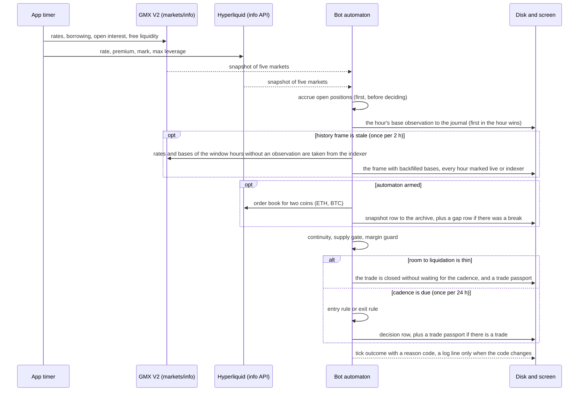
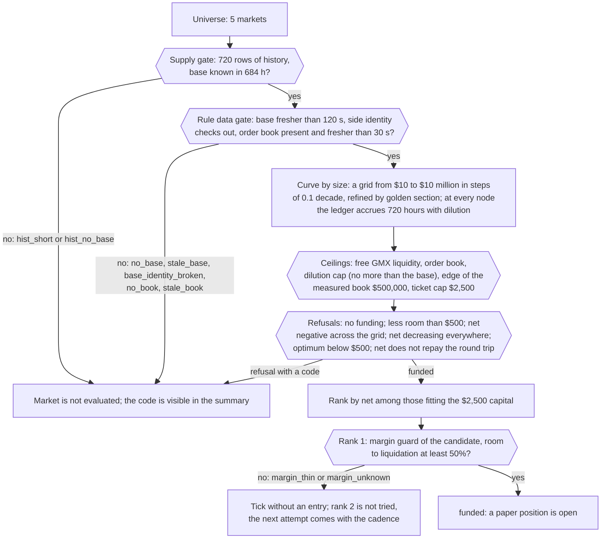
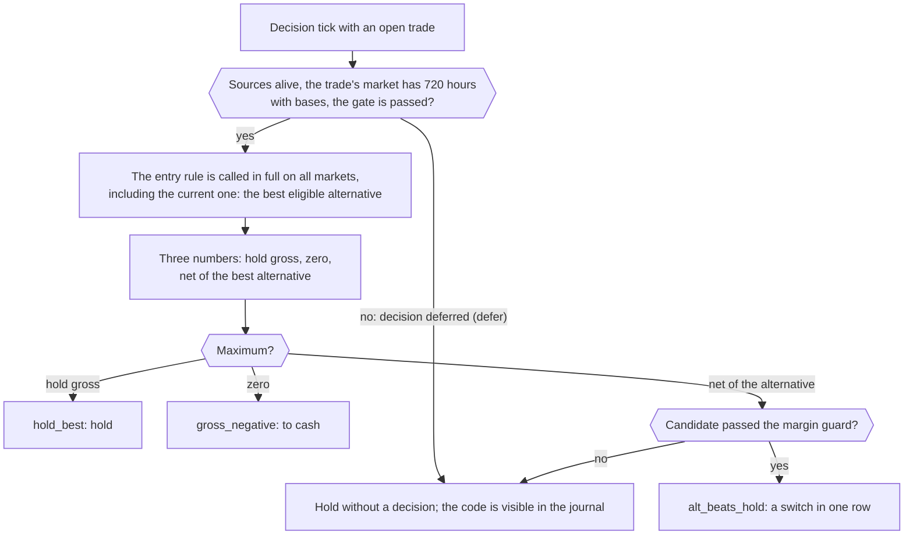
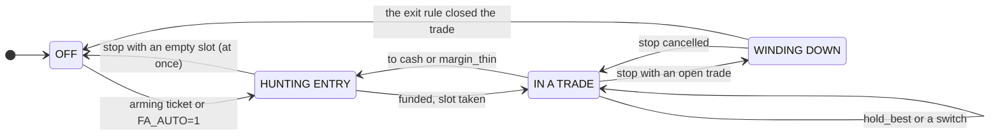
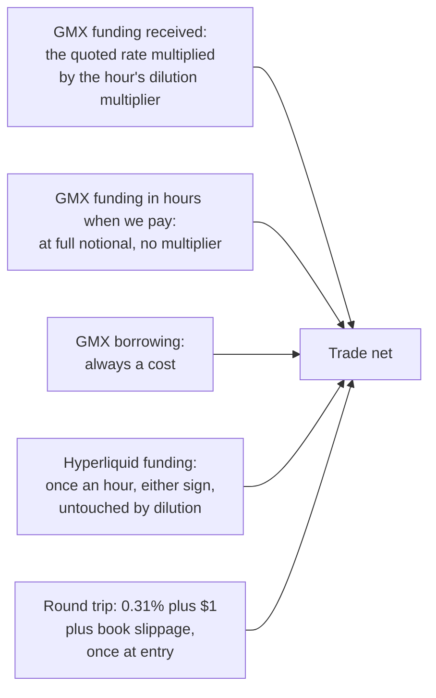

# Bot 1 "Funding-arb": how it works

What the bot does, when and why - the whole life cycle of a trade: data accumulation, the gate,
entry, holding, exit and the next entry. The body of the guide is split into three parts by the
phases of a trade's life: before the trade, in the trade, exiting the trade. Terms are explained as
they appear; the glossary and the code map are at the end.

[Русская версия](bot1-funding-arb-how-it-works.ru.md) · The document matches the code as of
2026-09-02.

**Important.** The bot trades on paper only. No real money moves, no orders are sent to any
exchange, the application holds no account keys. It reads public GMX V2 and Hyperliquid data (and a
reference price from Binance) and models what would happen to an account. It is a research instrument, not investment advice; no
profit is promised, and no annual return is built from what is shown.

---

## The gist in 30 seconds

Bot 1 works like a landlord: it rents out the side of the market that is missing and collects an
hourly fee for it.

- On perpetual markets one side is always overcrowded and the other is short of takers. The
  exchange makes the crowded side **pay the missing side** for every hour of holding. That fee is
  called funding.
- The bot takes the missing side on GMX V2 (which one exactly, the sign of the rates says each time)
  and receives the fee. To stay independent of price, it
  takes the opposite side of the same asset on Hyperliquid at the same time. The two positions are
  called **legs**; together they are neutral to price.
- The fee is split among everyone standing on the receiving side. Our entry adds one more landlord,
  and each gets less. This is **dilution**, and without it any income estimate would be a phantom.
  To compute it the bot needs a **base**: how much money already stands on our side in each hour.
- The bot observes the current hour's base itself on every poll, and backfills the window hours it
  has not seen from the indexer history under the side identity check: **the gate (684 hours of
  720) passes on the first frame refresh**, within two hours of launch, not after four weeks. Then,
  once a day, it picks the market and the size with the entry rule, holds the position, and once a
  day asks the exit rule: hold, go to cash or switch.

The bot does all of this by itself. There is one control: the automaton switch. The operator arms
it and watches; there is no manual trade opening in the application.

---

## The whole life cycle

Eight steps, one line each; the details are in the three parts below.

1. **Start.** The application lifts the automaton state, the paper positions, the journals of
   observed bases and the history frames from disk. Exchange polling starts by itself; the automaton
   is on or off exactly as it was before the restart.
2. **Arming.** The operator confirms the arming ticket (or the machine was launched with the
   `FA_AUTO=1` flag). Parameters are frozen at that moment and accompany the trade until it closes.
3. **Accumulation.** Every 5 minutes the bot reads both exchanges, writes a snapshot to the archive
   and records the funding base of the current hour for every market. Window hours the polling has
   not seen are backfilled from the indexer history on every frame refresh (once per two hours)
   under the side identity check; a live observation ranks above history and is never overwritten.
4. **Gate.** On a 720 hour window the base must be known in at least 684 hours, live or backfilled.
   Until then the market does not enter the decision; normally the gate passes on the first frame
   refresh, within two hours of launch.
5. **Decision.** Once a day the entry rule computes, for every eligible market, the optimal size and
   the net over 720 hours, sifts markets by refusal codes and funds the rank 1 market.
6. **Trade.** A paper position opens: two legs for the two-leg scheme (GMX and Hyperliquid), one for
   the one-leg scheme (GMX only). The ledger accrues the result hour by hour with dilution.
7. **Holding and exit.** Every tick the margin guard runs; once a day the exit rule: hold, to cash or
   switch. Thin room to liquidation closes the trade without waiting for the day to pass.
8. **Next entry.** After closing the slot is empty, and the next decision cycle looks for an entry
   again. So on until the operator stops the automaton.

---

# PART I. BEFORE THE TRADE

In this phase the bot accumulates one specific input without which the computation would be a lie,
and computes nothing until it has it.

## Every 5 minutes: a tick

One tick is one cycle of "read, accrue, record, decide, name the reason". The interval is set by the
polling pill: 1, 5 or 15 minutes; 5 by default.

What matters about ticks:

- **Public data only.** GMX is polled via `markets/info` on Arbitrum and Avalanche, Hyperliquid via
  `metaAndAssetCtxs`; the `l2Book` order book for two coins is pulled only while the automaton is
  armed. The bot sends no orders and authenticates nowhere.
- **The universe is fixed.** Five markets: two-leg ETH and BTC (GMX V2 on Arbitrum against
  Hyperliquid) and one-leg ETH-Arb, BTC-Arb (Arbitrum) and ETH-Avax (Avalanche), where there is a
  single leg: short on GMX with no counterweight.
- **Accrual goes first.** Open positions are accrued before the automaton decides: a decision on an
  under-accrued account would be a decision on different data.
- **Bases are observed always, and the backfill does not replace that.** The base journal is written
  on every poll, even with the automaton off: it is the only source of the current hour's base and
  the primary source of any hour. Within an hour polling runs twelve times, and the first
  observation wins: the journal is appended, not rewritten. Window hours without an observation are
  backfilled from the indexer history on a frame refresh and marked as backfilled; history never
  touches an observed hour.
- **No tick is silent.** Every tick has an outcome code: either an automaton refusal, or a rule code,
  or the single positive outcome `funded`. A log line goes out only when the code changes: a steady
  `hist_no_base` gives one line and then silence; liveness is visible in the tick counter and the
  last tick stamp on the console, not in the number of log lines.
- **A gap is an event.** A pause longer than five polling intervals (25 minutes at 5 minute polling)
  is written as a gap row with a cause; more in part II.

## Why bases are needed: dilution

The quoted funding rate is high precisely because the receiving side is small: the whole fee of the
crowded side is split among a few. Our entry adds our size to the receiving side, and each dollar
gets less. The bot receives not the quoted rate but a share of it: as much as the previous base
makes up in the base together with our entry.

An example from the code. The receiving side holds $100,000 and we add $2,000: we get 98.0% of the
quoted rate. It holds $2,000 and we add $2,000: exactly half. It holds zero: we get nothing, because
there is nobody to pay.

The price of the error is measured. The old ledger accrued the full quoted rate and on 25 markets out
of 63 booked itself more than the market paid all participants in a year: on MOODENG $651,526
against $6,812. That is why the entry rule on a frame without bases must refuse every market, and
any income estimate without bases is fiction. The three dilution rules in the ledger: the multiplier
is computed hour by hour, not as an average over the window; it applies only to the receiving GMX
leg (borrowing and the Hyperliquid leg are untouched); an hour in which we pay is not scaled at all.

Where the bases come from. The bot observes the current hour's base itself from live `markets/info`
on every poll. Window hours the polling has not seen (before launch, while the machine slept, during
a gap) are backfilled on a frame refresh from the `fundingBalanceOiSnapshots` history of the same
GMX indexer the frame already takes its rates from; the owner's decision of 2026-09-02, the earlier
ban of 2026-08-31 is lifted. The conditions of the backfill are not relaxed: a live observation
ranks above history and is never overwritten; only past full hours of the horizon window are
backfilled; every hour is checked by the side identity against the row's own rates, and an hour
where it fails (indexer zeros on a live market) stays a hole; every hour remembers where its base
came from, and the interface never calls a backfilled hour observed. The reindexing drift (40.4% of
hours by the last bit over 71 days) is below decision precision for bases: a check of the live base
against the indexer gives a median of 0.38% and a maximum of 3.36%.

## The gate: 684 hours of 720

Every tick the automaton takes the last 720 hours of the frame for every market and asks: in how
many of them is the base of our side known, live or backfilled? The threshold is 95%, that is 684
hours. A market
below the threshold does not pass the gate and does not enter the decision: no size, no net, no rank
is computed for it. If no market passes the gate, the tick ends with the code `hist_no_base` (or
`hist_short` when a market has fewer than 720 rows of history).

Why computing on incomplete data is forbidden. An hour without a base gives zero income, so an
estimate on incomplete coverage is biased downward, and the rule would rather refuse a good market
than enter a bad one. For entry that is safe; for holding it is expensive: an understated gross
pushes the exit rule to cash and to switching, and every such decision costs a round trip (about
$8.75 at $2,500). That is why the gate is the same for entry and for holding. The value 0.95 was set
by the owner, not measured: a threshold of 1.0 would carry the risk of never entering (any hole
postpones the decision until it leaves the window), 0.95 tolerates 36 holes per window at the cost
of understating gross by up to 5%.

Timing. The backfill closes the window hours without an observation on the first frame refresh, that
is no later than two hours after launch, provided the indexer has those hours; the 28.5 day wait is
gone. Holes remain where the indexer did not return an hour or the identity failed, and the gate
tolerates them up to 5% of the window (36 hours); beyond that an hour of observation adds exactly
one covered hour, and the date on the console is a lower bound. **The first decision comes on the
first tick after the gate passes, and the 24 hour cadence counts from it; so the first paper trade
is possible within the first two hours after launch.** Observation runs with the automaton off too.

What is visible meanwhile. On the Overview the bot card shows the token and the line "HUNTING ENTRY
· bases N of 684 h · live L, backfilled I". On the automaton console: the reason in words ("not
enough funding bases on the window") and in numbers ("market: the base is present in N of the 720 h
window (live L, backfilled I), 95% required"), the "Supply gate" column (markets polled, passed the
gate, best coverage against the required 95%, window horizon 720 h, window hours backfilled from the
indexer N of 720) and a notice: how many hours are missing, that the backfill closes them on the
next frame refresh, and no earlier than what moment the threshold can be reached by observation.

## The decision cycle once a day

Once at least one market has passed the gate, the automaton waits for the cadence: a decision is
taken no more often than once every 24 hours (the first one is allowed at once). Between decisions
the tick computes only the cheap gates; the expensive rules are called on the decision tick.

**The curve by size.** Income over 720 hours grows with size but saturates: the larger our entry, the
stronger the dilution, and in the limit we take the whole flow of the market, no more. Costs grow
linearly plus order book slippage, which grows faster than size. The difference has a single
maximum, and it is found numerically: on a logarithmic grid, then refined by golden section. At every
grid node the rule calls the same ledger that runs the real positions, with dilution switched on:
the rule has no accrual arithmetic of its own.

**What binds the size.** The optimum found is cut by ceilings, and the name of the binding one goes
into the summary and the journal: free GMX liquidity of our side, the visible Hyperliquid order
book, the level where the book runs out, the dilution cap (our size no more than the base weighted
by the receiving flow), the edge of the measured book curve ($500,000), the ticket cap. The rule's
ticket cap is $5,000, but the automaton lowers it to the trade capital of $2,500: only an alternative
that fits the capital counts as eligible, and without the adjustment the best markets would be
sifted out by a size we would not enter with anyway.

**Market selection.** A market is funded if its net over the horizon repays the round trip at its own
size at least once (net greater than the round trip, that is gross greater than two round trips).
The round trip is not a constant: 0.31% of notional plus $1 for the two-leg scheme (0.22% plus $1 for
the one-leg) plus the measured Hyperliquid book slippage at that size; $2.55 at $500, $7.20 at
$2,000, $8.75 at $2,500 without the book. The size rule's refusal codes, each reachable and visible
in the summary: `no_capital_cap`, `horizon_missing`, `src_gmx_down`, `src_hl_down`, `no_base`,
`stale_base`, `base_identity_broken`, `no_book`, `stale_book`, `no_funding`, `no_room`,
`below_min_ticket`, `decreasing_at_every_size`, `negative_at_every_size`, `below_fund_ratio`,
`no_capital_left`. Negative net across the whole grid is a normal outcome, not an error.

**Funding.** Funded markets are ranked by net; only those whose size fits $2,500 get a rank. Rank 1
passes the margin guard as a candidate (room to liquidation at the current price at least 50%) and
opens as a paper position. Both sizes are written into the trade passport: requested ($2,500, the
capital cap) and working (the one the rule settled on). On a market where the optimum hits the cap
they coincide; below the cap the working size is the optimum found.

**Arming parameters**, frozen at the moment of switching on: preset `fa-per-market-h720-v1`, capital
per trade $2,500, leverage 1 on each leg, required room to liquidation 50%, decision cadence 24 h,
decision expiry 72 h, required base coverage 95%. The cadence is measured: 24 hours give the same net
as 1 hour, over 27 round trips instead of 44. The expiry and the coverage are named assumptions in
the code. Editing the defaults after arming does not catch up with a running trade; re-arming
resets the continuity accumulator, so the `FA_AUTO=1` flag leaves an already armed automaton alone.

**The word "profitability"** here means an estimate of income 720 hours ahead under the assumption
that the last 720 hours of rates and bases repeat. It is not a return and not a forecast, and no
annual estimate is built from it.

What is visible meanwhile. The "Last evaluation by market" card: a row for each of the five markets
with the outcome (funded; a refusal with a code, including a gate code; "not evaluated" with a
reason that covered the whole slice, for example a source being down), the binding
constraint, size, net over the horizon, rank, base coverage, retained share and the quoted scheme
rate at the moment of evaluation. The evaluation is daily: the header carries the time it was taken,
the capital ceiling and the time before which there will be no next one. Between cycles the universe
is not recomputed, and the card promises no live process. The "Ⅰ · The bot's market" zone shows the
rank 1 market as the candidate while there is no trade.

## What the bot does not do in this phase

- **It does not enter manually.** There is no manual launch channel in the interface or in the main
  process; this is under test. Positions are opened only by the entry rule.
- **It does not overwrite an observed base with history.** The indexer backfill closes only hours
  without an observation, only inside the gate window and only under the side identity check; the
  base journal is written only by live polling.
- **It does not compute annual return.** Neither on the cards nor in the journal; the interface
  dictionaries are tested for the absence of promises of future income.
- **It does not decide more often than once a day.** Except the margin guard: its refusal cannot be
  repaired by the next decision and does not wait for the cadence.
- **It does not act on the first tick after launch** (`boot_warmup`), **after a polling gap**
  (`poll_gap`) or on the first tick after silence longer than 72 hours (`state_stale`): continuity
  must be observed. All three states clear on the next continuous tick.

---

# PART II. IN THE TRADE

## Two legs and where the result drips from

The two-leg scheme has two legs on different exchanges. Configuration A: a short leg on GMX
(receives funding, pays borrowing) and a long one on Hyperliquid; configuration B: the other way
round. Which configuration is chosen is decided by the sign of the rates at the moment of
evaluation: the one where the quoted net is higher. The one-leg scheme has one leg: short on GMX with
collateral in the asset itself, no counterweight. Leverage is 1 on each leg, and the leg notional
equals the trade size.

The result drips in hour by hour, and the ledger keeps it in three items:

- **GMX funding** accrues continuously, per second, at the quoted rate multiplied by the hour's
  dilution multiplier. An hour in which we pay enters in full, without a multiplier.
- **GMX borrowing** is always a cost, per second, untouched by dilution.
- **Hyperliquid funding** accrues discretely, once per crossed hour boundary, in either direction,
  untouched by dilution: our entry into the GMX base does not change it.

The round trip (entry plus exit) is deducted once at opening and frozen on the position. A position
without the dilution flag in the ledger would be accrued at the full quoted rate; for the automaton's
trades the flag is always on.

## The margin guard on every tick

The legs sit on different exchanges, there is no cross margin between them, and the profit of the
surviving leg does not support the losing one: the position is neutral in sum and liquidatable leg by
leg. So on every tick, not only on the decision tick, the guard computes for each leg the room to
the liquidation price:

- the liquidation price sits at the move from the entry price that wipes the collateral down to the
  maintenance margin; at leverage 1 for the Hyperliquid leg that is a 98.75% move for BTC
  (maintenance margin 1.25% from the exchange's max leverage of 40) and 98% for ETH (2% from a
  leverage of 25);
- the maintenance margin of the GMX leg is taken as zero: there is no measured value in the
  repository, and this is an optimistic assumption named in the code;
- the room is computed from the **current** price, not the entry price: for a position halfway to
  liquidation the room from entry would not have changed at all;
- the worst leg decides: its room is compared with the required 50%.

At leverage 1 the 50% threshold never binds at entry (room 98% and above); it starts binding at
leverage 2 or during holding, when the price has moved against a leg. At leverage 1, for any scheme,
that happens when the price has risen by about a third from the entry price: the short leg dies when
the price doubles, and from a price a third higher the distance to the doubling is exactly half of
that price. Thin room on an open trade
(`margin_thin`) is not "do nothing" but a demand to close: the guard's refusal cannot be repaired by
the next decision, and waiting for the cadence means waiting for liquidation. Unknown room
(`margin_unknown`: no price, leverage or maintenance margin) does not demand closing: it is a supply
refusal, and paying a round trip for a source hiccup is not allowed. The liquidation price of a
paper position is always computed by the model, never read from the exchange, and it goes into the
record with the source label "model".

**Why the ledger does not model liquidation and what that means for the P&L.** The shown result is
the result of the funding curve, and by construction it contains no risk of a leg liquidation.
Measured: BERA, February 2026, a +127.59% move over the holding stretch; the short leg dies at a move
of about +95%, that is even at leverage 1; the deposit of $3,991 becomes $2,373, minus 41%, which
equals 2.30 years of the strategy's net income. Frequency in the measurement: 2 stretches out of 132
at leverage 1, 10 at leverage 2, 46 at leverage 3. The guard catches this event during holding and
closes the trade before liquidation; liquidation itself never happens in the ledger, and the shown
P&L does not contain this risk.

## Recording: three streams

While the automaton is armed, every tick writes an archive to disk in the `scan-records` folder;
files are cut by UTC day:

- `fa-snap-<day>.ndjson` - a market snapshot on every poll: rates and borrowing of both sides,
  Hyperliquid rate and premium, funding bases of both sides, free liquidity, mark, max leverage,
  eight nodes of the book curve, data age of both sources; with an open trade a position block with
  notional, collateral, price and liquidation price of each leg. Gap rows live here too.
- `fa-dec-<day>.ndjson` - the decision computation at every decision point: data age, capital,
  preset, trailing window, curves of all funded markets, all refusals, the exit rule block.
- `fa-trade-<day>.ndjson` - the trade passport on entry, exit and switch: both sizes, both legs with
  collateral and liquidation price, itemized costs, the reason.

The volume is measured: a snapshot row with a position and five markets is about 2.2 KB, at 5 minute
polling 0.63 MB per day and 0.23 GB per year; snapshots make up over 99% of the volume. Retention is
infinite: the application cannot delete records, and there is no deletion channel.

**What survives a restart.** The automaton state (the switch, frozen parameters, the slot, the
continuity accumulator, the stamp of the last tape row) lives in `funding-arb-auto.json`; the last
evaluation summary in `funding-arb-auto-eval.json`; paper positions with full accrual journals in
`positions.json`; base journals in `fa-bases/`; history frames in `frame-cache/`. A corrupt automaton
file goes to quarantine and the automaton comes up switched off: a silently replaced state is a
silently switched on or off bot. The accrual gap over the downtime is closed from history hour by
hour, not at the current rate.

**A polling gap.** A pause in the tape longer than five intervals (25 minutes at 5 minute polling)
is written as a gap row with the number of lost slots and a cause out of five: the automaton was
switched off, the machine was asleep, the app was restarting, the source was not responding, cause
not established. The cause is not invented: no hint covered the gap, therefore "not established".
The gap is measured on the tape itself, not on a session timer, so an app restart shows as a gap
instead of erasing its own trace. On the tick after a gap no decision is taken (`poll_gap`); the
margin guard is computed and shown on it, but a close on thin room happens on the next continuous
tick: in the code precedence the gap ranks above the guard.

**Why a silent log is not a stop.** A log line goes out only when the outcome code changes. A live
automaton whose code does not change stays silent for days; liveness is visible in the tick counter
and the last tick stamp on the console and in the growth of the snapshot file.

## What is visible

- **The console**: the token "IN A TRADE", the reason of the last tick in words and numbers
  (`cadence_wait` between decisions, `hold_best` on the decision tick), the slot with the market
  name, ticks, the longest gap, the last tick and the last decision.
- **Account honesty**, four measurements, each meaning that the shown profit is larger than the real
  one: the quoted flow against the received one and the retained share (measured: at a $2,000 slot
  per market about 8.8% of the quoted flow stays with us, at $10,000 about 6.3%); requested and
  working size side by side; room to liquidation of the worst leg against the required 50% with the
  liquidation price of each leg and the permanent line "the shown P&L does not contain this risk";
  the line "out of sample the rule did not reproduce itself" with the numbers $214.80 against
  $429.99.
- **Zone Ⅱ · Trading**: account P&L since launch (net, after one-off costs), the positions table,
  the parameters of the selected position, the forward equity curve from t0, the ledger with CSV,
  XLSX and JSON export.
- **Zone Ⅰ · The bot's market**: the panels of the trade's market over a 30 day window equal to the
  rule's horizon.
- **Automaton trade history**: the open trade stands as a row with the chip "live" and a dash instead
  of a result.

## What the bot does not do in the trade

- **It sets no stops and caps no loss.** The arming ticket says so: "loss: not capped". The only
  protective mechanism is the margin guard, and it is about a leg's survival, not the realized result.
- **It does not adjust the size.** The notional is frozen at entry. A size change is possible only as
  a switch into the same market with a different size by the exit rule, at the price of a full round
  trip.
- **It does not rebalance the legs and does not hedge price.** The legs are equal in notional from
  entry; the counterweight does not move.
- **It does not open a second trade.** There is one slot; a portfolio was refuted by measurement.

---

# PART III. EXITING THE TRADE

## The exit rule once a day

On the decision tick (once every 24 hours) the exit rule compares three numbers in the same units,
dollars over 720 hours ahead:

- **hold** = the gross of the current position over the horizon, on the last 720 hours of rates and
  bases, at the fixed size;
- **to cash** = zero;
- **switch** = the net of the best alternative: the gross of the new position minus the full round
  trip of its costs, exactly the number the entry rule returns for every eligible market.

The maximum wins. The cost of closing the current position is paid in any of the three branches and
therefore does not enter the criterion; the realized result of the position does not enter either:
it is sunk and cannot affect the choice of branch. Cash is an alternative with net zero, not a
separate branch, so the rule has no order of checks that could be mixed up. Ties go to inaction:
inaction is free, action costs a round trip. The criterion has no free parameters: it is assembled
from the entry rule's numbers and zero.

What follows from this and what is measured:

- **Hysteresis exists and has the right width.** Leaving A for B requires the net of B to beat the
  gross of A; coming back requires the reverse. On unchanged data both at once are impossible: the
  width of the band equals a round trip, that is exactly what oscillation costs.
- **The current market is part of the universe of alternatives.** A switch into the same market with
  a different size is legitimate and is exactly how a size change is expressed, at the price of a
  full round trip.
- **The rule exits earlier than the account and later than the market.** Measured on 63 markets: exit
  precision 69.8% against 47.8% for a random exit of the same frequency, median lead minus 54 hours,
  40.4% of episodes caught in advance. Averaging over a window cannot run ahead of a change.
- **To cash never fired on the working set**: 0 out of 8,041 decisions. While the universe is not
  empty, a switch covers cash. The branch remains the third element of the maximum and is needed when
  the universe is empty or has refused.
- **The gate is the same as at entry.** A source failure defers the whole decision, not only the
  switch branch: without a source "no alternatives" would look like "hold". Base coverage is checked
  on the trade's market too: if observation was interrupted and the backfill did not close the hole
  (the indexer did not return the hour or the identity failed), coverage can fall below 684 hours,
  and then the exit rule does not decide until the hole is closed by a backfill or leaves the
  window, while the margin guard keeps working on every tick.

## Three outcomes and the journal

- **Hold** (`hold_best`): nothing happens, the decision row is written.
- **To cash** (`gross_negative`): the position closes with the tail of the accrual settled, a
  passport with the realized result and the reason goes into the trade stream, the slot is empty.
- **Switch** (`alt_beats_hold`): closing the previous position and opening the new one is one decision
  and one passport row with both sides; the round trip is computed on the size of the side being
  opened.

Separately from the exit rule, the margin guard closes the trade with the code `margin_thin`, on any
tick where continuity has been observed, without waiting for the cadence.

The decision journal gets a row for every cycle: time UTC, candidates (passed the entry rule out of
those checked), the best market and configuration, its size, net, retained share, the base of the
opposite side, what bound the size, the rank of the held market among the candidates, the decision,
the exit rule triple (hold gross, switch net, gain, including a negative one: "would have switched
but fell short" and "no alternative at all" are different states) and the reason. The pair "quoted
rate · ours" is deliberately absent from the journal: the decision stream does not write an annual
rate.

## Stopping the automaton

Stopping is two-step: the "stop the automaton" button on the console (or "Stop the automaton" on the
Overview) turns into "confirm the stop?" and reverts after 3.5 seconds without confirmation. With an
empty slot the automaton switches off at once. With an open trade the stop is only requested: the
token becomes "WINDING DOWN", there are no new entries, and the trade is run to the exit rule while
the margin guard keeps working, because it works only while the automaton ticks. As soon as the slot
is free, the switch goes off by itself. Leaving an open trade unattended is not allowed, so the
automaton has no "close immediately" button.

Cancelling the stop ("undo the stop") is a re-arming with the same frozen parameters: the request is
withdrawn, the tick counter and the "armed" stamp start over, and the last evaluation summary goes
dark until the next decision cycle.

Console tokens: "NO DATA" (the state has not arrived yet), "STATE CORRUPT" (the file is in
quarantine, the automaton is off), "OFF", "HUNTING ENTRY", "IN A TRADE", "WINDING DOWN", "STOPPING"
(a stop request with no open trade; in the normal flow the automaton switches off at once in this
case, and the token is hardly ever seen).

## A position opened before the switch to the automaton

The bot no longer has a manual launch, but closing is preserved: a position opened before the switch
to the automaton lies in the ledger and is closed manually with the button in the "Ⅱ · Trading"
zone. While it is open, the slot is taken: the console says "taken by a position opened before the
switch to the automaton", the automaton answers with the code `no_slot` and will not open a new
trade. The automaton has no right to run someone else's trade, so neither the exit rule nor the
margin guard looks at it.

## What is visible

- **Decision and scanning journal**: the columns are listed above; unreadable archive rows (a torn
  tail after a crash) are shown as a number in the footer.
- **The evaluation card**: during holding the row of the current market stands next to the
  alternatives, and the rank of the held market is visible both here and in the journal.
- **Automaton trade history**: one row per trade with both sizes, entry and exit time, hours, costs,
  the result in dollars and in percent of capital and the exit reason.
- **The token** on the Overview and on the tab follows the automaton state, not the presence of a
  position: a bot that hunts for an entry for weeks reads "HUNTING ENTRY", not "NOT RUNNING".

## What the bot does not do at exit

- **It does not exit on a realized loss.** The position's result never enters the criterion.
- **It does not exit on time.** The trade has no holding term and no expiry; the evaluation window is
  always the last 720 hours, however long the position has lived.
- **It does not exit on a low retained share.** With the market flow preserved, income grows when the
  base falls, and a guard on retention would close the most profitable positions; it is deliberately
  absent from the code.
- **It does not top up cheaply.** A size change is always a full round trip, because the measured
  cost model does not split the round trip into an entry half and an exit half.

---

## Where the result comes from and what can go wrong

The trade has one income: the fee for the missing side, and what arrives is its share after
dilution. Against it stand three items: GMX borrowing, the hours of our own payment, the one-off round
trip. The Hyperliquid leg contributes its own fee in either direction.

Honestly about the numbers. The project answered the question "is the strategy profitable" with
measurements before the automaton, and the answer is negative:

- the client's threshold of $25-30 thousand a year is not reached at any capital: the maximum of the
  honest curve of the full perimeter is $22,705 at a capital of $300,000, and on the strict perimeter
  (only the GMX leg counts as income) $2,673;
- 79-111% of the gross income of the full perimeter comes from the undilutable Hyperliquid leg, that
  is, it is a Hyperliquid perpetual carry hedged on GMX, not a GMX funding arbitrage;
- out of sample, on the project's second period, the rule produced $214.80 a year against $429.99 for
  plain "enter and hold": the baseline beats the rule twofold; the caveat in the other direction: that
  period has none of the small names on which the first year earned, and the project has no data to
  settle the dispute;
- the switch branch has no measured edge: cross-market switches paid off in 43% of cases at a 24 h
  cadence on a sample of two dozen, which is a coin toss;
- a leg liquidation is not modeled by the ledger, and one BERA episode wipes out 2.30 years of net
  income;
- market mortality is not represented in the measurements at all: all 94 rate cache series end on the
  same date, there is not one delisted market among them, and every number of the project must be
  read as an upper estimate by survivorship.

The point of the live run is therefore not income: to check that the automaton, the recording and the
rules work on live data the way they did in the runs, and that live dilution and live costs agree
with the model. The four measurements of the honesty card stand on the screen permanently for that.

---

## The full feature set of the tab

The tab consists of two zones: "Ⅱ · Trading" (console, evaluation, honesty, archive, history,
journal, account result) and "Ⅰ · The bot's market" (data of the market the automaton named). There
are no toggles in either.

| Feature | What it does |
|---|---|
| Automaton console | State token and chip, the last tick's reason in words and numbers, supply gate (markets polled, passed the gate, best base coverage, horizon), continuity and slot (ticks, longest gap, last tick, last decision, slot), the "N ticks · step" pill, the cadence note, an expandable explanation with the date of reaching the threshold |
| Arming ticket | Shows what the automaton does without you and the frozen parameters: entry rule, capital $2,500, leverage 1, room to liquidation 50%, cadence 24 h, expiry 72 h, base coverage 95%, "loss: not capped", "polling starts at boot: yes"; confirmation with one button |
| Stop and undo | Two-step stop with a 3.5 s rollback; with an open trade a wind-down to the exit rule; an undo button |
| Last evaluation by market | A row for each of the five markets: instrument, configuration, rank, outcome, what binds the size, size, net over the horizon, base coverage, retained share, scheme rate; the stamp "taken · capital ceiling · next no earlier than" |
| Account honesty | Four measurements: retained share of the quoted flow, requested and working size, room to a leg liquidation with liquidation prices, out of sample the rule did not reproduce itself |
| Recording archive | Read from disk on demand: window, polling slot coverage and gaps by cause, markets vanished from polling, codes outside the registries, room to liquidation by record, volume per day and on disk, retention in the subjunctive; a "Re-read" button; no deletion |
| Automaton trade history | A row per trade: number, instrument, configuration, requested and working size, entered, exited, hours, costs, result in dollars and percent, why it exited |
| Decision and scanning journal | A row per decision cycle: time, candidates, best, size, net, retained share, opposite side, what bound the size, rank of the held one, decision, exit rule triple, reason; newest first, 30 days and up to 500 rows |
| Account P&L since t0 | Realized result net after one-off costs, return on capital, APR since t0 after 24 hours of accrual |
| Positions and parameters | Table of all account positions (open and closed), parameters of the selected one, a close button for a position opened before the switch to the automaton, deletion of a closed position |
| Forward curve | Accumulated net equity since t0: GMX per second, Hyperliquid hourly |
| Ledger | Every accrual and position event as a row with filters and CSV, XLSX, JSON export |
| Zone Ⅰ · The bot's market | The pill "trade: market" or "candidate: market", an honest empty state until the first cycle; market data of both exchanges, net spread by intervals, decomposition by legs, reference price (Binance), raw hourly data; a 30 day window equal to the rule's horizon |
| Transaction costs · model | Editable items of the round trip (GMX fees, GMX slippage, gas, Hyperliquid fee, number of sides) at the bot's size; the net over the horizon is taken ready-made from the rule's evaluation |
| Freshness stamp and polling | The LIVE pill blinks on the arrival of a snapshot, "STALE" after 15 minutes without data, the stamp "data as of UTC"; polling interval 1, 5 or 15 minutes; clicking the pill refreshes the data now |
| Overview | The bot card with a dot, a chip and a state line ("HUNTING ENTRY · bases N of 684 h · live L, backfilled I"), the "Automaton console" button (leads to the ticket) or "Stop the automaton" (two steps) |
| Persistence | Automaton state, evaluation summary, positions with journals, base journals and history frames on disk; a restart resumes where it stopped, a corrupt state goes to quarantine |
| Languages and theme | Russian and English dictionaries, dark and light theme; refusal codes are translated by the dictionaries, not by the main process |
| Arming on a remote machine | The `FA_AUTO=1` flag arms the automaton at boot if it is not armed yet; parameters are frozen at the default values |

---

## What the bot does not do

- **It sends no real orders.** Only a paper simulation on live public data; the application has no
  keys and no access to money.
- **It offers no manual launch.** The only control is the automaton switch; the market and the size
  are named by the entry rule. A position opened before the switch to the automaton is closed
  manually.
- **It takes no bases from history beyond the gate window and lets no history override an
  observation.** The backfill closes only window hours without a live observation, each under the
  side identity check.
- **It sets no stops, caps no loss, does not exit on time.** Exit only by the exit rule and by the
  margin guard.
- **It does not adjust the size and does not hedge price inside a trade.** The notional is frozen at
  entry.
- **It holds no more than one trade.** There is one slot.
- **It computes no annual return and promises no profit.** It shows the model's result, including
  losses, and four measurements by which the shown result is overstated.
- **It does not delete the archive.** Retention is infinite; the archive card shows what would have
  expired and deletes nothing.

---

## Glossary

| Term | Meaning |
|---|---|
| Funding | The hourly fee that the crowded side of a perpetual market pays to the missing side; the sign can be either |
| Leg | One position of the trade on one exchange; the two-leg scheme has two in opposite directions, the one-leg scheme has one |
| Two-leg scheme | A short leg on GMX and a long one on Hyperliquid (configuration A) or the reverse (B); neutral to price |
| One-leg scheme | A short leg on GMX with collateral in the asset itself; no counterweight |
| Funding base | How many dollars already stand on a side of the market, among which the fee is split; on GMX the product of rate and base is the same for both sides |
| Dilution | The reduction of the received rate by our own entry: we get a share equal to the previous base within the base together with our size |
| Retained share | What part of the quoted flow arrived after dilution; counted only over the receiving hours |
| GMX borrowing | The fee for borrowed liquidity on GMX; always a cost, untouched by dilution |
| Window, horizon | 720 hours (30 days): that many past hours the rule takes and that many hours ahead it estimates income |
| Supply gate | Checks without which a market does not enter the decision: 720 rows of history and a base known (live or backfilled) in 684 hours |
| Base coverage | The share of the window's hours in which the base of our side is known, live or backfilled from the indexer; threshold 95%; the console shows live and backfilled separately |
| Base backfill | Filling the window hours without a live observation from the indexer history on a frame refresh, under the side identity check; an observed hour is never overwritten |
| Tick | One poll of the exchanges with accrual, recording and a named outcome; every 5 minutes by default |
| Cadence | How often the expensive rules are called: once every 24 hours |
| Decision expiry | 72 hours of silence after which the first tick takes no decisions |
| Entry rule | Builds a net curve by size for every market, sifts by codes, ranks by net |
| Curve by size | Net over the horizon at every size on a logarithmic grid; the optimum is found numerically |
| Binding constraint | The ceiling the size ran into: GMX liquidity, the order book, dilution, the edge of the book, the ticket cap |
| Round trip | Entry and exit fees of both legs, slippage and gas, once per trade |
| Exit rule | The maximum of three numbers: hold gross, zero, net of the best alternative |
| Switch | Closing the current position and opening the best alternative in one decision, including into the same market with a different size |
| Margin guard | The check of the room to the liquidation price of the worst leg on every tick against the required 50% |
| Room to liquidation | How much price move from the current price is left to the price at which the leg's collateral is wiped |
| Slot | The single place for a trade; taken by the automaton's own position or by a position opened before the switch to the automaton |
| Requested and working size | The capital cap of $2,500 and the size the rule settled on; both are written |
| Snapshot, decision, passport | The three recording streams: every poll, every decision point, every trade |
| Polling gap | A pause longer than five intervals, written as a row with a cause |
| Paper trading | A simulation on live data without real orders and money |

---

## Code map

| Module | Role |
|---|---|
| `src/engine/fa/auto.js` | The automaton: tick, continuity, supply gate, refusal code precedence, arming parameters, threshold in hours and date, evaluation summary, intent |
| `src/engine/fa/bases.js` | The journal of observed bases, transfer into the frame, the history backfill of the gate window, window coverage by origin |
| `src/engine/fa/dilution.js` | Entry dilution: the multiplier, the GMX side identity, the three application rules |
| `src/engine/fa/sizing.js` | The entry size rule: curve by size, ceilings, refusal codes and bindings, the allocator, presets |
| `src/engine/fa/exit.js` | The exit rule: three numbers, cadence, the best alternative |
| `src/engine/fa/margin.js` | The margin guard: liquidation price and room per leg, codes |
| `src/engine/fa/record.js` | Live recording: three streams, gap causes, archive readers, volume |
| `src/engine/paper.js` | The paper ledger: opening, hourly accrual with dilution, closing, summaries |
| `src/engine/costs.js` | The round trip cost model |
| `src/engine/assemble.js`, `src/engine/sources.js`, `src/engine/universe.js` | Snapshots and frames, access to GMX and Hyperliquid, the rate and base history from the indexer, the universe of five markets |
| `src/engine/store.js` | State files, base journals, NDJSON records |
| `src/main/main.js` | The polling timer, arming by flag, the slice for the rules, intent execution, persistence, the `fa:*` channels |
| `src/main/fa-eval.js`, `src/main/fa-archive.js` | The last evaluation summary on disk; archive aggregates for the card |
| `src/renderer/index.html`, `src/renderer/locales/ru.js`, `en.js` | The tab and Overview interface, the dictionaries of both languages |
