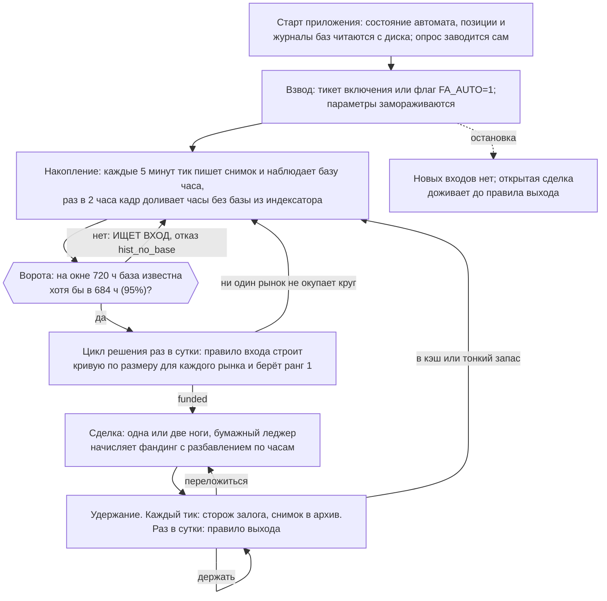
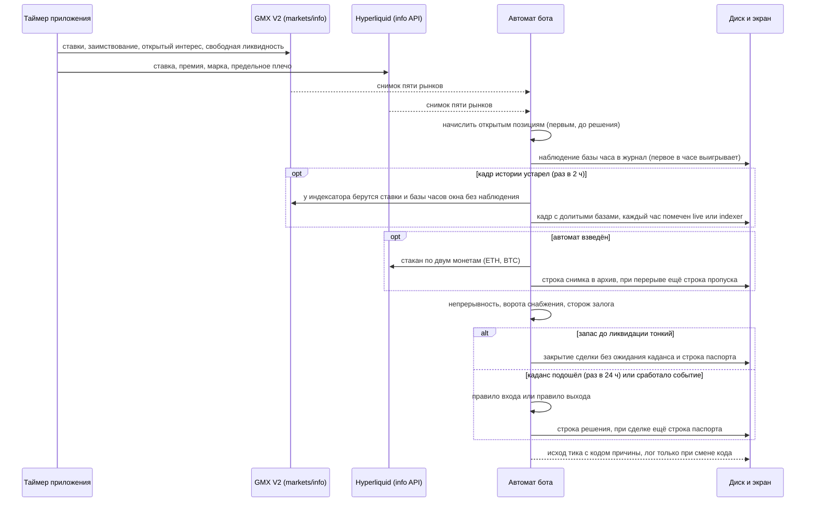
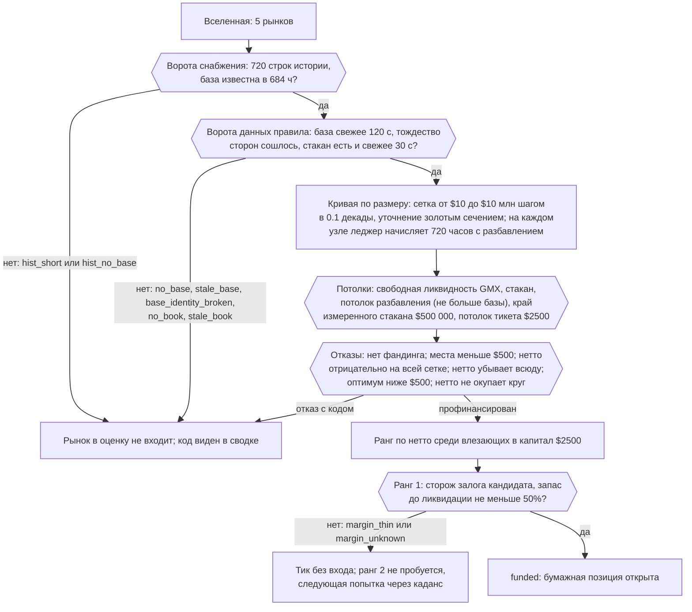
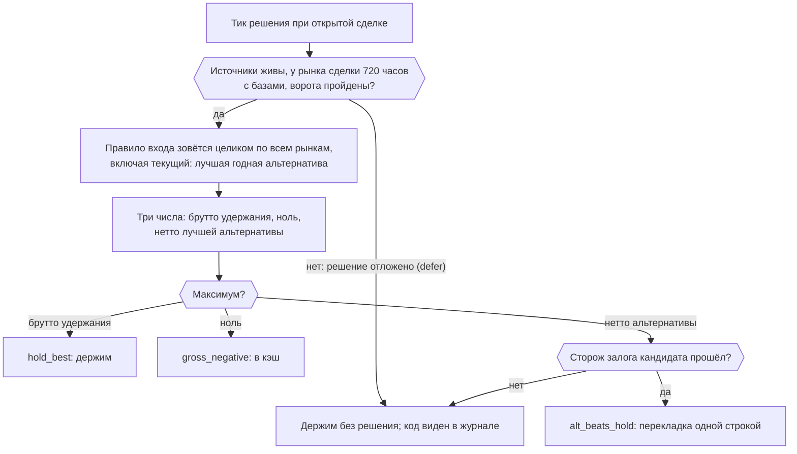
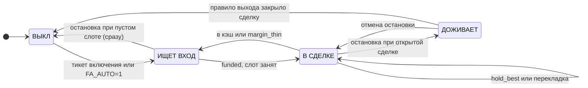
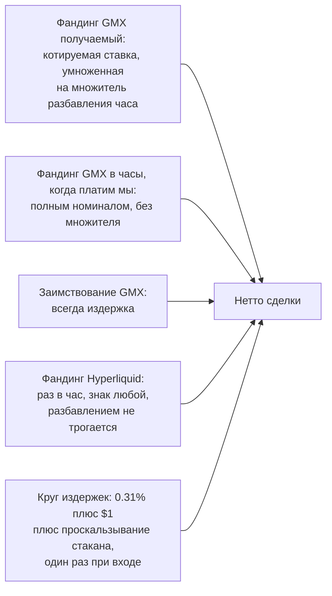

# Бот 1 «Funding-arb»: как он работает

Что бот делает, когда и зачем - весь цикл жизни сделки: накопление данных, ворота, вход,
удержание, выход и следующий вход. Тело руководства разбито на три части по фазам жизни сделки:
до сделки, в сделке, выход из сделки. Термины поясняются по ходу текста, словарик и карта кода -
в конце.

[English version](bot1-funding-arb-how-it-works.en.md) · Документ соответствует коду на 02.09.2026.

**Важно.** Бот торгует только на бумаге. Реальные деньги не двигаются, заявки на биржи не
отправляются, ключей от счёта у приложения нет. Он читает публичные данные GMX V2 и Hyperliquid
(и справочную цену с Binance) и моделирует, что происходило бы со счётом. Это исследовательский инструмент, а не инвестиционный
совет; прибыль не обещается, годовая доходность из показанного не строится.

---

## Суть за 30 секунд

Бот 1 работает как арендодатель: он сдаёт рынку недостающую сторону и берёт за это почасовую
плату.

- На бессрочных рынках одна сторона всегда переполнена, а другой не хватает. Биржа заставляет
  переполненную сторону **платить недостающей** за каждый час удержания. Эта плата называется
  фандингом.
- Бот встаёт на недостающую сторону на GMX V2 (какую именно, каждый раз говорит знак ставок) и
  получает плату. Чтобы не зависеть от цены, он либо одновременно встаёт на противоположную
  сторону того же актива на Hyperliquid (двуногая схема), либо держит залог в самом активе при
  плече 1 (одноногая схема: противовесом служит залог). Позиции называются **ногами**; в обеих
  схемах результат нейтрален к цене.
- Боту всё равно, куда входить: какая схема, какая монета, какая биржа. Перед сделкой правило
  входа считает все рынки вселенной одной экономикой, нетто за горизонт после круга издержек, и
  финансирует лучший; правило выхода сравнивает сделку со всеми альтернативами, включая другую
  схему.
- Плату делят между всеми, кто стоит на принимающей стороне. Наш вход добавляет ещё одного
  арендодателя, и каждому достаётся меньше. Это **разбавление**, и без него любая оценка дохода
  была бы фантомом. Чтобы его посчитать, боту нужна **база**: сколько денег уже стоит на нашей
  стороне в каждый час.
- Базу текущего часа бот наблюдает сам на каждом опросе, а часы окна, которых не видел, доливает
  историей индексатора с проверкой тождества сторон: **ворота (684 часа из 720) проходят на
  прогреве кадров при запуске**, обычно в первые минуты и самое позднее через два часа, а не
  через четыре недели. Затем раз в сутки он выбирает рынок и размер правилом входа, держит
  позицию, а раз в сутки, и раньше по событию, спрашивает правилом выхода: держать, в кэш или
  переложиться.

Всё это бот делает сам. Орган управления один: рубильник автомата. Оператор включает его и
наблюдает; ручного открытия сделок в приложении нет.

---

## Жизненный цикл целиком

Восемь шагов одной строкой каждый; подробности в трёх частях ниже.

1. **Старт.** Приложение поднимает с диска состояние автомата, бумажные позиции, журналы
   наблюдённых баз и кадры истории. Опрос бирж заводится сам, автомат включён или выключен ровно
   так, как был до перезапуска.
2. **Взвод.** Оператор подтверждает тикет включения (или машина запущена с флагом `FA_AUTO=1`).
   Параметры замораживаются в этот момент и сопровождают сделку до её закрытия.
3. **Накопление.** Каждые 5 минут бот читает обе биржи, пишет снимок в архив и записывает базу
   фандинга текущего часа по каждому рынку. Часы окна, которых опрос не видел, при каждом
   обновлении кадра (раз в два часа) доливаются историей индексатора с проверкой тождества
   сторон; живое наблюдение главнее и не перезаписывается.
4. **Ворота.** На окне в 720 часов база должна быть известна хотя бы в 684 часах, живьём или
   доливом. Пока нет, рынок в решение не входит; обычно ворота проходят на прогреве кадров при
   запуске, в первые минуты, самое позднее через два часа.
5. **Решение.** Раз в сутки правило входа считает по каждому годному рынку оптимальный размер и
   нетто за 720 часов, отсеивает рынки по кодам отказа и финансирует рынок ранга 1.
6. **Сделка.** Открывается бумажная позиция: две ноги у двуногой схемы (GMX и Hyperliquid), одна
   у одноногой (только GMX). Леджер начисляет результат по часам с разбавлением.
7. **Удержание и выход.** Каждый тик работает сторож залога, раз в сутки и по событию правило
   выхода: держать,
   в кэш или переложиться. Тонкий запас до ликвидации закрывает сделку, не дожидаясь суток.
8. **Следующий вход.** После закрытия слот пуст, и следующий цикл решения ищет вход заново. Так
   до тех пор, пока оператор не остановит автомат.

---

# ЧАСТЬ I. ДО СДЕЛКИ

В этой фазе бот копит один конкретный вход, без которого расчёт был бы враньём, и ничего не
считает, пока его нет.

## Каждые 5 минут: тик

Один тик - один цикл «прочитал, начислил, записал, решил, назвал причину». Интервал настраивается
пилюлей опроса: 1, 5 или 15 минут; по умолчанию 5.

Что важно знать про тики:

- **Данные только публичные.** GMX опрашивается по `markets/info` на Arbitrum и Avalanche,
  Hyperliquid по `metaAndAssetCtxs`; стакан `l2Book` по двум монетам тянется только пока автомат
  взведён. Заявок бот не отправляет и нигде не авторизуется.
- **Вселенная фиксирована.** Пять рынков: двуногие ETH и BTC (GMX V2 на Arbitrum против
  Hyperliquid) и одноногие ETH-Arb, BTC-Arb (Arbitrum) и ETH-Avax (Avalanche), где нога одна:
  короткая на GMX с залогом в самом активе, и при плече 1 залог сам служит противовесом. Для
  правила входа все пять рынков равноправны.
- **Начисление идёт первым.** Открытые позиции начисляются до того, как автомат решает: решение
  по недоначисленному счёту было бы решением по другим данным.
- **Базы наблюдаются всегда, и долив их не заменяет.** Журнал баз пишется на каждом опросе, даже
  при выключенном автомате: это единственный источник базы текущего часа и главный источник
  любого часа. Внутри часа опрос проходит двенадцать раз, и побеждает первое наблюдение: журнал
  дописывается, а не переписывается. Часы окна без наблюдения при обновлении кадра доливаются
  историей индексатора и помечаются как долитые; наблюдённый час история не трогает.
- **Ни один тик не молчит.** У каждого тика есть код исхода: либо отказ автомата, либо код
  правила, либо единственный положительный исход `funded`. В лог строка уходит только при смене
  кода: ровный `hist_no_base` даёт одну строку и дальше тишину, живость видна по счётчику тиков
  и по штампу последнего тика на пульте, а не по числу строк в логе.
- **Перерыв это событие.** Пауза дольше пяти интервалов опроса (25 минут при опросе раз в 5 минут)
  записывается строкой пропуска с причиной; подробнее в части II.

## Почему нужны базы: разбавление

Котируемая ставка фандинга высока ровно потому, что принимающая сторона мала: всю плату
переполненной стороны делят между немногими. Наш вход добавляет к принимающей стороне наш размер,
и на каждый доллар достаётся меньше. Бот получает не котируемую ставку, а её долю: столько, сколько
составляет прежняя база в базе с нашим входом.

Пример из кода. На принимающей стороне стоит $100 000, мы добавляем $2 000: нам достаётся 98.0%
котируемой ставки. Стоит там $2 000, и мы добавляем $2 000: ровно половина. Стоит ноль: не
достаётся ничего, потому что платить некому.

Цена ошибки измерена. Старый леджер начислял котируемую ставку целиком и на 25 рынках из 63 книжил
себе больше, чем рынок выплатил всем участникам за год: на MOODENG $651 526 против $6 812. Поэтому
правило входа на кадре без баз обязано отказать каждому рынку, и любая оценка дохода без баз это
фикция. Три правила разбавления в леджере: множитель считается почасово, а не средним по окну;
применяется только к принимающей ноге GMX (заимствование и нога Hyperliquid не трогаются); час, в
который платим мы, не масштабируется вовсе.

Откуда берутся базы. Базу текущего часа бот наблюдает сам из живого `markets/info` на каждом
опросе. Часы окна, которых опрос не видел (до запуска, во время сна машины или перерыва), при
обновлении кадра доливаются из истории `fundingBalanceOiSnapshots` того же индексатора GMX, у
которого кадр и так берёт ставки; решение владельца 02.09.2026, прежний запрет от 31.08.2026 снят.
Условия долива не смягчаются: живое наблюдение главнее и не перезаписывается никогда; доливаются
только прошлые полные часы окна горизонта; каждый час проверяется тождеством сторон против
собственных ставок строки, и час, где оно не сошлось (нули индексатора при живом рынке), остаётся
дырой; каждый час помнит, откуда взята база, и интерфейс не называет долитое наблюдённым. Живой час
сверяется тем же тождеством, но с допуском 5% вместо 1e-6: базу бот снимает в первую минуту часа, а
ставки строки индексатора относятся к границе часа, и за эту минуту открытый интерес успевает
сдвинуться; на живом прогоне 03.09.2026 строгий допуск отвергал треть живых часов BTC и за трое
суток опустил бы покрытие ниже 684 часов. Дрейф
переиндексации (40.4% часов на младший бит за 71 день) для баз ниже точности решения: сверка живой
базы с индексатором даёт медиану 0.38% и максимум 3.36%.

## Ворота: 684 часа из 720

Каждый тик автомат берёт последние 720 часов кадра по каждому рынку и спрашивает: в скольких из
них известна база нашей стороны, живьём или доливом? Порог 95%, то есть 684 часа. Рынок ниже порога ворота не
проходит и в решение не входит: ни размера, ни нетто, ни ранга по нему не считается. Если ворота
не прошёл ни один рынок, тик заканчивается кодом `hist_no_base` (или `hist_short`, когда у
рынка меньше 720 строк истории).

Почему считать на неполных данных запрещено. Час без базы даёт нулевой доход, поэтому оценка на
неполном покрытии смещена вниз, и правило скорее отказало бы хорошему рынку, чем вошло в плохой.
Для входа это безопасно, для удержания дорого: заниженное брутто толкает правило выхода в кэш и
в перекладку, а каждое такое решение стоит круга издержек (около $8.75 при $2500). Поэтому ворота
одни и те же для входа и для удержания. Значение 0.95 назначено владельцем, а не замерено: порог
1.0 давал бы риск никогда не войти (любая дыра откладывает решение до её выхода из окна), 0.95
терпит 36 дыр на окно ценой занижения брутто до 5%.

Сроки. Долив закрывает часы окна без наблюдения на прогреве кадров при запуске, за секунды, и
повторяется на каждом обновлении кадра, то есть самое позднее через два часа, если у индексатора
эти часы есть; ожидания в 28.5 суток больше нет. Дыры
остаются там, где индексатор часа не отдал или тождество не сошлось, и ворота терпят их до 5%
окна (36 часов); сверх этого час наблюдения прибавляет ровно один покрытый час, и дата на пульте
это оценка снизу. **Первое решение приходит на первом же тике после прохода ворот, а каданс в 24
часа отсчитывается от него; первый тик после запуска занят прогревом, значит первая бумажная
сделка возможна уже на втором тике, через один интервал опроса.** Живой прогон 02.09.2026: вход
через пять минут после рестарта. Наблюдение идёт и при выключенном автомате.

Что при этом видно. На Обзоре карточка бота показывает жетон и строку «ИЩЕТ ВХОД · базы N из
684 ч · живьём L, долито I». На пульте автомата: причина словами («баз фандинга на окне не
хватает») и числами («рынок: база есть в N из 720 ч окна (живьём L, долито I), требуется 95%»),
колонка «Ворота снабжения» (рынков в обходе, прошло ворота, лучшее покрытие при требуемых 95%,
окно оценки назад 720 ч, горизонт амортизации вперёд 720 ч, часов окна долито из индексатора N из
720) и плашка: сколько часов не
хватает, что долив закроет их на ближайшем обновлении кадра, и раньше какого момента порог не
наберётся наблюдением.

## Цикл решения раз в сутки

Когда хотя бы один рынок прошёл ворота, автомат ждёт каданса: решение принимается не чаще раза в
24 часа (первое разрешено сразу). Между решениями тик считает только дешёвые ворота; дорогие
правила зовутся на тике решения.

Боту всё равно, куда входить. Все пять рынков вселенной, двуногие и одноногие, на Arbitrum и на
Avalanche, считаются одним правилом и одной экономикой: кривая нетто по размеру за горизонт после
круга издержек. Схема, монета и биржа в критерий не входят, входит только нетто, и финансируется
ранг 1. Правило выхода сравнивает открытую сделку с теми же альтернативами, включая другую схему.

Два числа вместо одного. Окно оценки назад, 720 часов: столько последних часов ставок и баз берёт
правило, чтобы оценить поток, по нему режется кадр и считаются ворота. Горизонт амортизации
вперёд, 720 часов: на столько часов раскладывается круг издержек, брутто окна переводится на него
множителем «горизонт делить на окно». Сегодня оба равны, множитель равен единице, и это
единственное замеренное сочетание: любое другое это допущение до замера.

Между кадансами правило зовётся по событию. Три события, каждое относительно снимка прошлого
решения: ставка нашей ноги против нас шесть часов подряд, поток рынка упал вдвое, запас до
ликвидации сжался на десять пунктов. Событие двигает только момент решения; решает то же правило
с той же полосой гистерезиса шириной в круг, поэтому на неизменившихся данных перекладки от
события нет, а одно и то же условие не зовёт правило тик за тиком. Пороги это допущения, названные
числом и замороженные взводом; их цена в кругах не замерена, и повод каждого решения пишется в
запись и виден в журнале решений.

**Кривая по размеру.** Доход за 720 часов растёт с размером, но насыщается: чем больше наш вход,
тем сильнее разбавление, и в пределе мы забираем весь поток рынка, не больше. Издержки растут
линейно плюс проскальзывание по стакану, которое растёт быстрее размера. Разница даёт единственный
максимум, и он ищется численно: по логарифмической сетке, затем уточняется золотым сечением. На
каждом узле сетки правило зовёт тот же леджер, который ведёт настоящие позиции, с разбавлением
включённым: своей арифметики начисления у правила нет.

**Что связывает размер.** Найденный оптимум режут потолки, и имя связывающего едет в сводку и в
журнал: свободная ликвидность GMX нашей стороны, видимый стакан Hyperliquid, уровень, с которого
стакан кончается, потолок разбавления (наш размер не больше базы, взвешенной потоком получения),
край измеренной кривой стакана ($500 000), потолок тикета. Потолок тикета правила $5000, но автомат
приводит его к капиталу сделки $2500: годной считается только альтернатива, влезающая в капитал, и
без приведения лучшие рынки отсеивались бы по размеру, которым мы всё равно не вошли бы.

**Отбор рынка.** Рынок финансируется, если нетто за горизонт окупает круг издержек при своём
размере хотя бы один раз (нетто больше круга, то есть брутто больше двух кругов). Круг это не
константа: 0.31% ноционала плюс $1 у двуногой схемы (0.22% плюс $1 у одноногой) плюс измеренное
проскальзывание стакана Hyperliquid при этом размере; $2.55 при $500, $7.20 при $2000, $8.75 при
$2500 без стакана. Коды отказа правила размера, каждый достижим и виден в сводке: `no_capital_cap`,
`horizon_missing`, `src_gmx_down`, `src_hl_down`, `no_base`, `stale_base`, `base_identity_broken`,
`no_book`, `stale_book`, `no_funding`, `no_room`, `below_min_ticket`, `decreasing_at_every_size`,
`negative_at_every_size`, `below_fund_ratio`, `no_capital_left`. Отрицательное нетто на всей сетке
это нормальный исход, а не ошибка.

**Финансирование.** Профинансированные рынки ранжируются по нетто; ранг получают только те, чей
размер влезает в $2500. Ранг 1 проходит сторожа залога как кандидат (запас до ликвидации при
текущей цене не меньше 50%) и открывается бумажной позицией. В паспорт сделки пишутся оба размера:
заявленный ($2500, потолок капитала) и фактический (тот, на котором остановилось правило). На
рынке, где оптимум упирается в потолок, они совпадают; ниже потолка фактический это найденный
оптимум.

**Параметры взвода**, замороженные в момент включения: пресет `fa-per-market-h720-v1`, капитал на
сделку $2500, плечо 1 на каждую ногу, требуемый запас до ликвидации 50%, каданс решения 24 ч, срок
годности решения 72 ч, требуемое покрытие баз 95%. Каданс замерен: 24 часа дают то же нетто, что
1 час, за 27 кругов вместо 44. Срок годности и покрытие названы в коде допущениями. Правка
значений по умолчанию после взвода работающую сделку не догоняет; повторный взвод обнуляет
накопитель непрерывности, поэтому флаг `FA_AUTO=1` уже взведённый автомат не трогает.

**Слово «прибыльность»** здесь означает оценку дохода на 720 часов вперёд в предположении, что
последние 720 часов ставок и баз повторятся. Это не доходность и не прогноз, и годовая оценка из
неё не строится.

Что при этом видно. Карточка «Последняя оценка по рынкам»: строка на каждый из пяти рынков с
исходом (профинансирован; отказ с кодом, в том числе кодом ворот; «не оценивался» с причиной,
накрывшей весь срез, например лежащим источником), связывающим
ограничением, размером, нетто за горизонт, рангом, покрытием баз, долей удержания и котируемой
ставкой схемы на момент оценки. Оценка суточная: в шапке стоят время, когда она снята, потолок
капитала и время, раньше которого следующей не будет. Между циклами вселенная не пересчитывается,
и живого процесса карточка не обещает. Зона «Ⅰ · Рынок бота» показывает рынок ранга 1 как
кандидата, пока сделки нет.

## Чего бот в этой фазе не делает

- **Не входит вручную.** Канала ручного запуска нет ни в интерфейсе, ни в главном процессе; это
  под тестом. Позиции открывает только правило входа.
- **Не перезаписывает наблюдённую базу историей.** Долив из индексатора закрывает только часы без
  наблюдения, только в окне ворот и только под тождеством сторон; журнал баз пишется только живым
  опросом.
- **Не считает годовую доходность.** Ни на карточках, ни в журнале; словари интерфейса проверяются
  тестом на отсутствие обещаний будущего дохода.
- **Не решает чаще раза в сутки без повода.** Внеочередное решение бывает по трём событиям (ставка
  против нас несколько часов подряд, поток рынка упал вдвое, запас до ликвидации сжался), и
  решает при этом то же правило. Сторож залога стоит отдельно: его отказ невосстановим следующим
  решением и каданса не ждёт.
- **Не действует на первом тике после запуска** (`boot_warmup`), **после перерыва опроса**
  (`poll_gap`) и на первом тике после молчания дольше 72 часов (`state_stale`): непрерывность
  должна быть наблюдена. Все три состояния снимаются следующим непрерывным тиком.

---

# ЧАСТЬ II. В СДЕЛКЕ

## Две ноги и откуда капает результат

У двуногой схемы две ноги на разных биржах. Конфигурация A: короткая нога на GMX (получает
фандинг, платит заимствование) и длинная на Hyperliquid; конфигурация B: наоборот. Какая
конфигурация выбрана, решает знак ставок на момент оценки: та, где котируемое нетто выше.
У одноногой схемы нога одна: короткая на GMX с залогом в самом активе, и противовесом служит сам
залог. При плече 1 рост цены прибавляет к залогу ровно столько, сколько теряет шорт, а падение
отнимает столько, сколько шорт выигрывает, поэтому в долларах позиция нейтральна к цене, как и
двуногая. Именно поэтому леджер не книжит по ней ценового результата: её результат это фандинг
минус заимствование короткой стороны, и ничего больше. Нейтральность держится ровно при плече 1,
а оно заморожено параметром владельца. Плечо 1 на каждую ногу, ноционал ноги равен размеру сделки.

Результат капает по часам, и леджер ведёт его тремя статьями:

- **Фандинг GMX** начисляется непрерывно, посекундно, по котируемой ставке, умноженной на
  множитель разбавления этого часа. Час, в который платим мы, входит целиком, без множителя.
- **Заимствование GMX** это всегда издержка, посекундно, разбавлением не трогается.
- **Фандинг Hyperliquid** начисляется дискретно, один раз на каждую пройденную границу часа, в
  любую сторону, разбавлением не трогается: наш вход в базу GMX его не меняет.

Круг издержек (вход плюс выход) вычитается один раз при открытии и заморожен на позиции.
Позиция без флага разбавления в леджере считалась бы по котируемой ставке целиком; у сделок
автомата флаг включён всегда.

## Сторож залога каждый тик

Ноги стоят на разных биржах, кросс-маржи между ними нет, и прибыль уцелевшей ноги проигрывающую
не поддерживает: позиция нейтральна в сумме и ликвидируема поштучно. Поэтому на каждом тике, а не
только на тике решения, сторож считает по каждой ноге запас хода до цены ликвидации:

- цена ликвидации стоит на ходе от цены входа, который стирает залог до поддерживающей маржи;
  при плече 1 у ноги Hyperliquid это 98.75% хода для BTC (поддерживающая маржа 1.25% из
  предельного плеча биржи 40) и 98% для ETH (2% из плеча 25);
- поддерживающая маржа ноги GMX принята равной нулю: измеренного значения в репозитории нет, и
  это оптимистичное допущение, названное в коде;
- залог ноги GMX сторож считает в долларах в обеих схемах. У одноногой схемы залог стоит в самом
  активе и дорожает ровно на ход против шорта, поэтому при плече 1 цена сама по себе залог не
  стирает; расчёт сторожа для неё пессимистичен (запас 100% вместо неограниченного), и порог 50%
  он не задевает;
- запас считается от **текущей** цены, а не от цены входа: у позиции, прошедшей половину пути к
  ликвидации, запас от входа не изменился бы вовсе;
- решает худшая нога: её запас сравнивается с требуемыми 50%.

При плече 1 на входе порог 50% не связывает никогда (запас 98% и выше); связывать он начинает с
плеча 2 или на удержании, когда цена ушла против ноги. При плече 1 у любой схемы это случается,
когда цена выросла примерно на треть от цены входа: короткая нога умирает на удвоении цены, а от
цены, выросшей на треть, до удвоения остаётся ровно половина этой цены. Тонкий запас на открытой
сделке (`margin_thin`)
это не «ничего не делаем», а требование закрытия: отказ сторожа невосстановим следующим решением,
и ждать каданса значит ждать ликвидации. Неизвестный запас (`margin_unknown`: нет цены, плеча или
поддерживающей маржи) закрытия не требует: это отказ снабжения, а платить круг за икоту источника
нельзя. Цена ликвидации у бумажной позиции всегда посчитана моделью, а не прочитана у биржи, и в
запись она едет с ярлыком источника «model».

**Почему леджер ликвидацию не моделирует и что это значит для P&L.** Показанный результат это
результат кривой финансирования, и по построению он не содержит риска ликвидации ноги. Замер:
BERA, февраль 2026, ход +127.59% за отрезок удержания; короткая нога умирает на ходе около +95%,
то есть даже при плече 1; депозит $3991 становится $2373, минус 41%, что равно 2.30 года чистого
дохода стратегии. Частота на замере: 2 отрезка из 132 при плече 1, 10 при плече 2, 46 при плече 3.
Сторож ловит это событие на удержании и закрывает сделку до ликвидации; сама ликвидация в леджере
не наступает никогда, и показанный P&L этого риска не содержит.

## Запись: три потока

Пока автомат взведён, каждый тик пишет архив на диск в папку `scan-records`, файлы режутся по
суткам UTC:

- `fa-snap-<день>.ndjson` - снимок рынка каждый опрос: ставки и заимствование обеих сторон, ставка и
  премия Hyperliquid, базы фандинга обеих сторон, свободная ликвидность, марка, предельное плечо,
  восемь узлов кривой стакана, возраст данных обоих источников; при открытой сделке блок позиции
  с ноционалом, залогом, ценой и ценой ликвидации каждой ноги. Здесь же строки пропуска.
- `fa-dec-<день>.ndjson` - расчёт решения на каждой точке решения: возраст данных, капитал, пресет,
  окно трейлинга, кривые всех профинансированных рынков, все отказы, блок правила выхода.
- `fa-trade-<день>.ndjson` - паспорт сделки при входе, выходе и перекладке: оба размера, обе ноги с
  залогом и ценой ликвидации, издержки по статьям, причина.

Объём замерен: строка снимка с позицией и пятью рынками около 2.2 КБ, при опросе раз в 5 минут
0.63 МБ в сутки и 0.23 ГБ в год; снимки составляют больше 99% объёма. Срок хранения бесконечен:
приложение не умеет удалять записи, и канала на удаление нет.

**Что переживает перезапуск.** Состояние автомата (тумблер, замороженные параметры, слот,
накопитель непрерывности, метка последней строки ленты) лежит в `funding-arb-auto.json`; сводка
последней оценки в `funding-arb-auto-eval.json`; бумажные позиции с полными журналами начисления в
`positions.json`; журналы баз в `fa-bases/`; кадры истории в `frame-cache/`. Битый файл автомата
уходит в карантин, и автомат поднимается выключенным: молча подменённое состояние это молча
включённый или выключенный бот. Разрыв в начислении за время простоя закрывается историей по
часам, а не текущей ставкой.

**Перерыв опроса.** Пауза в ленте дольше пяти интервалов (25 минут при опросе раз в 5 минут)
пишется строкой пропуска с числом потерянных слотов и причиной из пяти: автомат был выключен,
машина спала, приложение перезапускалось, источник не отвечал, причина не установлена. Причина не
выдумывается: не покрыл ни один признак, значит «не установлена». Перерыв меряется по самой ленте,
а не по таймеру сессии, поэтому перезапуск приложения виден как перерыв, а не стирает свой след.
На тике после перерыва решений не принимается (`poll_gap`); сторож залога на нём считается и
показывается, а закрытие по тонкому запасу произойдёт на следующем непрерывном тике: в приоритете
кодов перерыв стоит выше сторожа.

**Почему молчание лога не остановка.** Строка в лог уходит только при смене кода исхода. Живой
автомат, у которого код не меняется, молчит сутками; живость видна по счётчику тиков и штампу
последнего тика на пульте и по росту файла снимков.

## Что видно

- **Пульт**: жетон «В СДЕЛКЕ», причина последнего тика словами и числами (`cadence_wait` между
  решениями, `hold_best` на тике решения), слот с именем рынка, тики, самый долгий перерыв,
  последний тик и последнее решение.
- **Честность счёта**, четыре замера, и каждый означает, что показанная прибыль больше настоящей:
  котируемый поток против полученного и доля удержания (замер по 63 рынкам за год: при рабочем размере $2500 на
  рынок остаётся около 8.4% котируемого потока, при $2000 около 8.8%, при $10 000 около 6.3%); заявленный и фактический размер рядом;
  запас до ликвидации худшей ноги при требуемых 50% с ценой ликвидации каждой ноги и постоянной
  строкой «показанный P&L этого риска не содержит»; строка «вне выборки правило себя не
  воспроизвело» с числами $214.80 против $429.99.
- **Зона Ⅱ · Торговля**: P&L счёта с момента запуска (нетто, после разовых издержек), таблица
  позиций, параметры выбранной позиции, форвардная кривая капитала с t0, журнал операций с
  выгрузкой CSV, XLSX и JSON.
- **Зона Ⅰ · Рынок бота**: панели рынка сделки на окне 30 суток, равном горизонту правила.
- **История сделок автомата**: открытая сделка стоит строкой с чипом «идёт» и прочерком вместо
  итога.

## Чего бот в сделке не делает

- **Не ставит стопов и не ограничивает убыток.** В тикете включения так и написано: «убыток: не
  ограничен». Единственный защитный механизм это сторож залога, и он про выживание ноги, а не про
  реализованный результат.
- **Не подправляет размер.** Ноционал заморожен моментом входа. Изменение размера возможно только
  как перекладка в тот же рынок другим размером по правилу выхода, ценой полного круга.
- **Не перевзвешивает ноги и не хеджирует цену.** Ноги равны по ноционалу с момента входа;
  противовес не двигается.
- **Не открывает вторую сделку.** Слот один; портфель опровергнут замером.

---

# ЧАСТЬ III. ВЫХОД ИЗ СДЕЛКИ

## Правило выхода раз в сутки и по событию

На тике решения (раз в 24 часа либо по событию, см. «Цикл решения») правило выхода сравнивает
три числа в одних единицах, долларах за горизонт вперёд, 720 часов:

- **держать** = брутто текущей позиции на горизонте, по последним 720 часам ставок и баз (окно
  оценки назад), при зафиксированном размере;
- **в кэш** = ноль;
- **переложиться** = нетто лучшей альтернативы: брутто новой позиции минус полный круг её
  издержек, ровно то число, которое правило входа возвращает каждому годному рынку.

Побеждает максимум. Стоимость закрытия текущей позиции платится в любой из трёх веток и потому в
критерий не входит; реализованный итог позиции тоже не входит: он утоплен и на выбор ветки влиять
не может. Кэш это альтернатива с нетто ноль, а не отдельная ветка, поэтому порядка проверок,
который можно перепутать, у правила нет. Ничьи решаются в пользу бездействия: бездействие
бесплатно, действие стоит круга. Свободных параметров у критерия нет: он собран из чисел правила
входа и нуля.

Что из этого следует и что замерено:

- **Гистерезис есть и нужной ширины.** Уйти из A в B требует, чтобы нетто B обошло брутто A;
  вернуться требует обратного. На неизменившихся данных оба сразу невозможны: ширина полосы равна
  кругу, то есть ровно тому, во что обходится колебание.
- **Текущий рынок входит во вселенную альтернатив.** Перекладка в тот же рынок другим размером
  законна и именно так выражается изменение размера, ценой полного круга.
- **Правило выходит раньше счёта и позже рынка.** Замер на 63 рынках: точность выходов 69.8%
  против 47.8% у случайного выхода той же частоты, медианное упреждение минус 54 часа,
  заблаговременно поймано 40.4% эпизодов. Усреднение по окну не может опережать изменение.
- **В кэш на рабочем наборе не сработало ни разу**: 0 из 8041 решения. Пока вселенная не пуста,
  перекладка накрывает кэш. Ветка остаётся третьим элементом максимума и нужна при пустой или
  отказавшей вселенной.
- **Ворота те же, что у входа.** Отказ источника откладывает решение целиком, а не только ветку
  перекладки: без источника «альтернатив нет» выглядело бы как «держим». Покрытие баз проверяется
  и на рынке сделки: если наблюдение прервалось, а долив дыру не закрыл (индексатор часа не отдал
  или тождество не сошлось), покрытие может упасть ниже 684 часов, и тогда правило выхода не
  решает, пока дыра не закроется доливом или не выйдет из окна, а сторож залога продолжает
  работать каждый тик.

## Три исхода и журнал

- **Держать** (`hold_best`): ничего не происходит, строка решения записана.
- **В кэш** (`gross_negative`): позиция закрывается с досчётом хвоста начисления, в поток сделок
  уходит паспорт с реализованным итогом и причиной, слот пуст.
- **Переложиться** (`alt_beats_hold`): закрытие прежней и открытие новой это одно решение и одна
  строка паспорта с обеими сторонами; круг посчитан по размеру открываемой стороны.

Отдельно от правила выхода сделку закрывает сторож залога кодом `margin_thin`, на любом тике, где
непрерывность наблюдена, без ожидания каданса.

В журнале решений появляется строка на каждый цикл: время UTC, кандидатов (прошло правило входа
из проверенных), лучший рынок и конфигурация, его размер, нетто, доля удержания, база встречной
стороны, что связало размер, ранг удерживаемого рынка среди кандидатов, решение, тройка правила
выхода (брутто удержания, нетто перекладки, выигрыш, в том числе отрицательный: «переложились бы,
но не хватило» и «альтернативы нет» это разные состояния) и причина. Пары «котируемая ставка ·
наша» в журнале нет намеренно: поток решений годовой ставки не пишет.

## Остановка автомата

Остановка двухшаговая: кнопка «остановить автомат» на пульте (или «Остановить автомат» на Обзоре)
переходит в «подтвердить остановку?» и через 3.5 секунды без подтверждения возвращается. При пустом
слоте автомат выключается сразу. При открытой сделке остановка только запрашивается: жетон
становится «ДОЖИВАЕТ», новых входов нет, а сделка ведётся до правила выхода, и сторож залога
продолжает работать, потому что он работает только пока автомат тикает. Как только слот
освободился, тумблер гаснет сам. Бросать открытую сделку без присмотра нельзя, поэтому кнопки
«закрыть немедленно» у автомата нет.

Отмена остановки («отменить остановку») это повторный взвод теми же замороженными параметрами:
запрос снимается, счётчик тиков и штамп «включён» начинаются заново, а сводка последней оценки
гаснет до следующего цикла решения.

Жетоны пульта: «НЕТ ДАННЫХ» (состояние ещё не пришло), «СОСТОЯНИЕ БИТО» (файл в карантине,
автомат выключен), «ВЫКЛ», «ИЩЕТ ВХОД», «В СДЕЛКЕ», «ДОЖИВАЕТ», «ОСТАНОВКА» (запрос остановки без
открытой сделки; в штатном потоке автомат в этом случае выключается сразу, и жетон почти не виден).

## Позиция, открытая до перехода на автомат

Ручного запуска у бота больше нет, а закрытие сохранено: позиция, открытая до перехода на автомат,
лежит в леджере и закрывается вручную кнопкой в зоне «Ⅱ · Торговля». Пока она открыта, слот
занят: пульт пишет «занят позицией, открытой до перехода на автомат», автомат отвечает кодом
`no_slot` и новую сделку не откроет. Вести чужую сделку автомат не имеет права, поэтому ни правило
выхода, ни сторож залога на неё не смотрят.

## Что видно

- **Журнал решений и сканирования**: столбцы перечислены выше; нечитаемые строки архива (оборванный
  хвост после падения) показаны числом в подвале.
- **Карточка оценки**: на удержании строка текущего рынка стоит рядом с альтернативами, и ранг
  удерживаемого рынка виден и здесь, и в журнале.
- **История сделок автомата**: одна строка на сделку с обоими размерами, временем входа и выхода,
  часами, издержками, итогом в долларах и в процентах к капиталу и причиной выхода.
- **Жетон** на Обзоре и на вкладке следует состоянию автомата, а не наличию позиции: бот, который
  ищет вход неделями, значится «ИЩЕТ ВХОД», а не «НЕ ЗАПУЩЕН».

## Чего бот при выходе не делает

- **Не выходит по реализованному убытку.** Итог позиции в критерий не входит ни разу.
- **Не выходит по времени.** Ни срока удержания, ни экспирации у сделки нет; окно оценки всегда
  последние 720 часов, сколько бы позиция ни жила.
- **Не выходит по низкой доле удержания.** При сохранённом потоке рынка доход растёт, когда база
  падает, и охрана по удержанию закрывала бы самые доходные позиции; в коде её нет намеренно.
- **Не доразмещает дёшево.** Изменение размера всегда полный круг, потому что деления круга на
  половину входа и половину выхода измеренная модель издержек не даёт.

---

## Откуда берётся результат и что может пойти не так

Приход у сделки один: плата за недостающую сторону, и достаётся её доля после разбавления.
Против него три статьи: заимствование GMX, часы собственной уплаты, разовый круг. Нога Hyperliquid
даёт свою плату в любую сторону.

Честно о числах. Проект ответил на вопрос «прибыльна ли стратегия» замерами до автомата, и ответ
отрицательный:

- порог заказчика $25-30 тысяч в год не достигается ни на каком капитале: максимум честной кривой
  полного периметра $22 705 при капитале $300 000, а на строгом периметре (доходом считается только
  нога GMX) $2 673;
- 79-111% валового дохода полного периметра приходит с неразбавляемой ноги Hyperliquid, то есть
  это керри перпетуала Hyperliquid с хеджем на GMX, а не арбитраж фандинга GMX;
- вне выборки, на втором периоде проекта, правило дало $214.80 в год против $429.99 у простого
  «вошли и держим»: база бьёт правило вдвое; оговорка в другую сторону: в том периоде нет малых
  имён, на которых первый год и заработал, и данных, чтобы решить спор, в проекте нет;
- у ветки перекладки края не измерено: межрыночные перекладки окупились в 43% случаев при кадансе
  24 ч на выборке в два десятка, это монетка;
- ликвидация ноги леджером не моделируется, а один эпизод BERA стирает 2.30 года чистого дохода;
- смертность рынков в замерах не представлена вовсе: все 94 ряда кэша ставок обрываются одной
  датой, делистнутых рынков среди них ноль, и любое число проекта надо читать как оценку сверху по
  выживаемости.

Смысл живого прогона поэтому не в доходе: проверить, что автомат, запись и правила работают на
живых данных так же, как в прогонах, и что живое разбавление и живые издержки сходятся с моделью.
Четыре замера карточки честности стоят на экране постоянно ради этого.

---

## Полный функционал вкладки

Вкладка состоит из двух зон: «Ⅱ · Торговля» (пульт, оценка, честность, архив, история, журнал,
результат счёта) и «Ⅰ · Рынок бота» (данные рынка, который назвал автомат). Переключателей нет ни
в той, ни в другой.

| Возможность | Что делает |
|---|---|
| Пульт автомата | Жетон состояния и чип, причина последнего тика словами и числами, ворота снабжения (рынков в обходе, прошло ворота, лучшее покрытие баз, горизонт), непрерывность и слот (тиков, самый долгий перерыв, последний тик, последнее решение, слот), пилюля «N тик. · шаг», заметка о кадансе, разворачиваемое объяснение с датой достижения порога |
| Тикет включения | Показывает, что автомат делает без вас, и замороженные параметры: правило входа, капитал $2500, плечо 1, запас до ликвидации 50%, каданс 24 ч, срок годности 72 ч, покрытие баз 95%, пороги событий внеочередного решения, «убыток: не ограничен», «опрос заводится на буте: да»; подтверждение одной кнопкой |
| Остановка и отмена | Двухшаговая остановка с откатом через 3.5 с; при открытой сделке доживание до правила выхода; кнопка отмены остановки |
| Последняя оценка по рынкам | Строка на каждый из пяти рынков: инструмент, конфигурация, ранг, исход, чем связан размер, размер, нетто за горизонт, покрытие баз, доля удержания, ставка схемы; штамп «снята · потолок капитала · следующая не раньше» |
| Честность счёта | Четыре замера: доля удержания котируемого потока, заявленный и фактический размер, запас до ликвидации ноги с ценами ликвидации, вне выборки правило себя не воспроизвело |
| Архив записи | Читается с диска по требованию: окно, покрытие слотов опроса и перерывы по причинам, рынки, пропавшие из опроса, коды вне реестров, запас до ликвидации по записи, объём в сутки и на диске, срок хранения сослагательно; кнопка «Перечитать»; удаления нет |
| История сделок автомата | Строка на сделку: номер, инструмент, конфигурация, размер заявленный и фактический, вошли, вышли, часов, издержки, итог в долларах и процентах, почему вышли |
| Журнал решений и сканирования | Строка на цикл решения: время, кандидаты, лучший, размер, нетто, доля удержания, встречная сторона, что связало размер, ранг удержания, решение, тройка правила выхода, причина; свежие сверху, 30 суток и до 500 строк |
| P&L счёта с t0 | Реализованный результат нетто после разовых издержек, доходность к капиталу, APR с t0 после 24 часов начисления |
| Позиции и параметры | Таблица всех позиций счёта (открытых и закрытых), параметры выбранной, кнопка закрытия для позиции, открытой до перехода на автомат, удаление закрытой позиции |
| Форвардная кривая | Накопленная equity нетто с t0: GMX посекундно, Hyperliquid почасово |
| Журнал операций | Каждое начисление и событие позиции строкой с фильтрами и выгрузкой CSV, XLSX, JSON |
| Зона Ⅰ · Рынок бота | Пилюля «сделка: рынок» или «кандидат: рынок», честное пустое состояние до первого цикла; рыночные данные обеих бирж, чистый спред по интервалам, декомпозиция по ногам, справочная цена (Binance), первичные данные по часам; окно 30 суток равно горизонту правила |
| Транзакционные издержки · модель | Редактируемые статьи круга (комиссии GMX, проскальзывание GMX, газ, комиссия Hyperliquid, число сторон) на размере бота; нетто за горизонт берётся готовым из оценки правила |
| Штамп свежести и опрос | Пилюля LIVE мигает на приход снимка, «УСТАРЕЛО» после 15 минут без данных, штамп «данные по состоянию на UTC»; интервал опроса 1, 5 или 15 минут; клик по пилюле обновляет данные сейчас |
| Обзор | Карточка бота с точкой, чипом и строкой состояния («ИЩЕТ ВХОД · базы N из 684 ч · живьём L, долито I»), кнопка «Пульт автомата» (ведёт к тикету) или «Остановить автомат» (два шага) |
| Персист | Состояние автомата, сводка оценки, позиции с журналами, журналы баз и кадры истории на диске; перезапуск продолжает с места остановки, битое состояние уходит в карантин |
| Языки и тема | Русский и английский словари, тёмная и светлая тема; коды отказов переводятся словарями, а не главным процессом |
| Взвод на удалённой машине | Флаг `FA_AUTO=1` взводит автомат на буте, если он ещё не взведён; параметры замораживаются значениями по умолчанию |

---

## Чего бот не делает

- **Не отправляет реальные заявки.** Только бумажная симуляция на живых публичных данных;
  ключей и доступа к деньгам у приложения нет.
- **Не даёт ручного запуска.** Единственный орган управления это рубильник автомата; рынок и
  размер называет правило входа. Позиция, открытая до перехода на автомат, закрывается вручную.
- **Не берёт базы из истории дальше окна ворот и не даёт истории перебить наблюдение.** Долив
  закрывает только часы окна без живого наблюдения, каждый под тождеством сторон.
- **Не ставит стопов, не ограничивает убыток, не выходит по времени.** Выход только по правилу
  выхода и по сторожу залога.
- **Не подправляет размер и не хеджирует цену внутри сделки.** Ноционал заморожен входом.
- **Не держит больше одной сделки.** Слот один.
- **Не считает годовую доходность и не обещает прибыль.** Показывает результат модели, включая
  убытки, и четыре замера, на которые показанное завышено.
- **Не удаляет архив.** Срок хранения бесконечен; карточка архива показывает, что вышло бы за
  срок, и ничего не удаляет.

---

## Словарик

| Термин | Значение |
|---|---|
| Фандинг | Почасовая плата, которую переполненная сторона бессрочного рынка платит недостающей; знак бывает любой |
| Нога | Одна позиция сделки на одной бирже; у двуногой схемы их две в противоположные стороны, у одноногой одна |
| Двуногая схема | Короткая нога на GMX и длинная на Hyperliquid (конфигурация A) или наоборот (B); нейтральна к цене |
| Одноногая схема | Короткая нога на GMX с залогом в самом активе; при плече 1 залог служит противовесом, позиция нейтральна к цене в долларах, результат это фандинг минус заимствование |
| База фандинга | Сколько долларов уже стоит на стороне рынка, между которыми делят плату; у GMX произведение ставки на базу одинаково для обеих сторон |
| Разбавление | Уменьшение получаемой ставки от нашего собственного входа: нам достаётся доля, равная прежней базе в базе с нашим размером |
| Доля удержания | Какая часть котируемого потока досталась после разбавления; считается только по часам получения |
| Заимствование GMX | Плата за заёмную ликвидность на GMX; всегда издержка, разбавлением не трогается |
| Окно оценки назад | 720 часов (30 суток): столько последних часов ставок и баз берёт правило; по нему режется кадр и считаются ворота |
| Горизонт амортизации вперёд | 720 часов: на столько часов раскладывается круг издержек; брутто окна переводится на него множителем «горизонт делить на окно», сегодня равным единице |
| Ворота снабжения | Проверки, без которых рынок в решение не входит: 720 строк истории и база, известная (живьём или доливом) в 684 часах |
| Покрытие баз | Доля часов окна, в которых известна база нашей стороны, живьём или доливом из индексатора; порог 95%; на пульте живое и долитое показаны порознь |
| Долив баз | Заполнение часов окна без живого наблюдения историей индексатора при обновлении кадра, под тождеством сторон; наблюдённый час не перезаписывается |
| Тик | Один опрос бирж с начислением, записью и названным исходом; раз в 5 минут по умолчанию |
| Каданс | Как часто зовутся дорогие правила без повода: раз в 24 часа |
| Событие внеочередного решения | Повод позвать правило между кадансами: ставка против нас несколько часов подряд, поток рынка упал вдвое, запас до ликвидации сжался; меряется от снимка прошлого решения |
| Срок годности решения | 72 часа молчания, после которых первый тик решений не принимает |
| Правило входа | Строит кривую нетто по размеру для каждого рынка, отсеивает по кодам, ранжирует по нетто |
| Кривая по размеру | Нетто за горизонт при каждом размере на логарифмической сетке; оптимум ищется численно |
| Связывающее ограничение | Потолок, в который упёрся размер: ликвидность GMX, стакан, разбавление, край стакана, потолок тикета |
| Круг издержек | Комиссии входа и выхода обеих ног, проскальзывание и газ, один раз на сделку |
| Правило выхода | Максимум трёх чисел: брутто удержания, ноль, нетто лучшей альтернативы |
| Перекладка | Закрытие текущей позиции и открытие лучшей альтернативы одним решением, в том числе в тот же рынок другим размером |
| Сторож залога | Проверка запаса до цены ликвидации худшей ноги на каждом тике против требуемых 50% |
| Запас до ликвидации | Сколько хода цены от текущей осталось до цены, на которой залог ноги стёрт |
| Слот | Единственное место под сделку; занят своей позицией или позицией, открытой до перехода на автомат |
| Заявленный и фактический размер | Потолок капитала $2500 и размер, на котором остановилось правило; пишутся оба |
| Снимок, решение, паспорт | Три потока записи: каждый опрос, каждая точка решения, каждая сделка |
| Перерыв опроса | Пауза дольше пяти интервалов, записанная строкой с причиной |
| Бумажная торговля | Симуляция на живых данных без реальных заявок и денег |

---

## Карта кода

| Модуль | Роль |
|---|---|
| `src/engine/fa/auto.js` | Автомат: тик, непрерывность, ворота снабжения, приоритет кодов отказа, параметры взвода, порог в часах и дата, сводка оценки, намерение |
| `src/engine/fa/bases.js` | Журнал наблюдённых баз, перенос в кадр, долив истории в окно ворот, покрытие окна по происхождению |
| `src/engine/fa/dilution.js` | Разбавление входа: множитель, тождество сторон GMX, три правила применения |
| `src/engine/fa/sizing.js` | Правило размера входа: кривая по размеру, потолки, коды отказа и связывающие, распределитель, пресеты |
| `src/engine/fa/exit.js` | Правило выхода: три числа, каданс, лучшая альтернатива |
| `src/engine/fa/events.js` | События внеочередного решения: почасовое нетто, полоса убыточных часов, поток рынка, снимок решения, реестр поводов |
| `src/engine/fa/margin.js` | Сторож залога: цена ликвидации и запас по ногам, коды |
| `src/engine/fa/record.js` | Живая запись: три потока, причины перерывов, читатели архива, объём |
| `src/engine/paper.js` | Бумажный леджер: открытие, начисление по часам с разбавлением, закрытие, сводки |
| `src/engine/costs.js` | Модель круга издержек |
| `src/engine/assemble.js`, `src/engine/sources.js`, `src/engine/universe.js` | Снимки и кадры, доступ к GMX и Hyperliquid, история ставок и баз из индексатора, вселенная пяти рынков |
| `src/engine/store.js` | Файлы состояния, журналы баз, записи NDJSON |
| `src/main/main.js` | Таймер опроса, взвод флагом, срез для правил, исполнение намерения, персист, каналы `fa:*` |
| `src/main/fa-eval.js`, `src/main/fa-archive.js` | Сводка последней оценки на диске; агрегаты архива для карточки |
| `src/renderer/index.html`, `src/renderer/locales/ru.js`, `en.js` | Интерфейс вкладки и Обзора, словари обоих языков |
