# BotLab: руководство по BTC-опционам

Модуль проверяет опционную стратегию на текущих данных Deribit. Он не отправляет ордера и не использует реальные деньги.

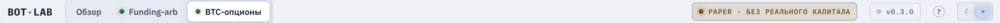
*Бейдж **PAPER · без реального капитала** в шапке: модуль работает на данных Deribit, но не отправляет ордера и не тратит реальные деньги.*

Стратегия состоит из четырех опционов с одной датой экспирации:

- покупка колла со страйком около текущей цены BTC;
- покупка пута с тем же страйком;
- продажа колла с более высоким страйком;
- продажа пута с более низким страйком.

Колл дает покупателю право купить актив по заданной цене, пут дает право продать его. Продавец принимает соответствующее обязательство и получает премию. Страйк представляет заданную цену, а экспирация момент окончания опциона. ATM означает страйк около текущей цены BTC, OTM более далёкий страйк.

Купленные ATM-опционы дают прибыль при достаточно сильном движении BTC в любую сторону. Если BTC останется около центрального страйка, уплаченная премия может стать убытком. Проданные OTM-опционы, или крылья, уменьшают стоимость входа, но ограничивают прибыль при большом движении. Премия и P&L опционов `BTC_USDC` выражены в USDC. Приложение выбирает экспирацию не позднее трех дней.

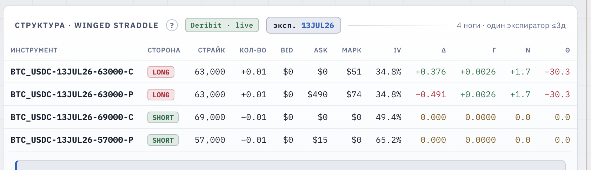
*Четыре ноги одной экспирации: два купленных ATM-опциона (**LONG**) и два проданных крыла (**SHORT**). Премии ног `BTC_USDC` — в USDC, экспиратор ≤ 3 дней.*

Текущую направленную чувствительность позиции называют дельтой. Например, `Total Δ = +0.10 BTC` означает, что небольшой рост BTC приблизительно влияет на P&L как владение 0.10 BTC. Для снижения этой зависимости движок моделирует встречную позицию в бессрочном фьючерсе `BTC-PERPETUAL`. Это дельта-хедж. Он приближает общую дельту к нулю, но не устраняет остальные риски опционов.

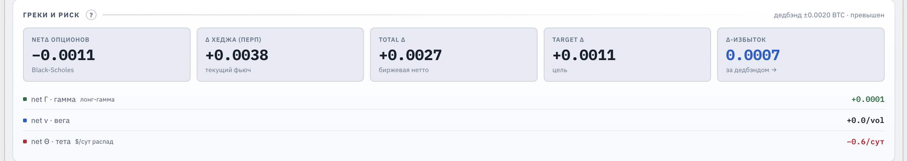
*`Total Δ` — суммарная направленная чувствительность позиции; дельта-хедж перпетуалом приближает её к целевому нулю.*

Режим paper trading означает расчет торговли без реальных ордеров. Модуль читает публичный REST API Deribit, не запрашивает API-ключи и не имеет доступа к биржевому счету. Начальный бумажный депозит равен $100. В текущем интерфейсе изменить его нельзя.

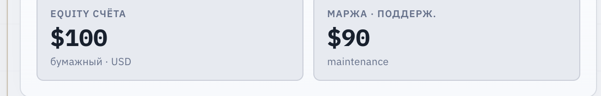
*Начальный бумажный депозит — **$100**; в текущем интерфейсе изменить его нельзя.*

Интерфейс разделен на две зоны:

- **«Ⅰ · Конструктор структуры»** показывает расчет будущей позиции. Изменения здесь не меняют уже открытую позицию.
- **«Ⅱ · Хедж-движок · Paper Trading»** показывает открытую бумажную позицию, решения движка и накопленный P&L.

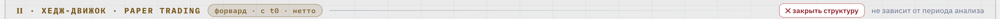
*Зона **Ⅱ · Хедж-движок · Paper Trading**: открытая бумажная позиция, решения движка и накопленный P&L.*

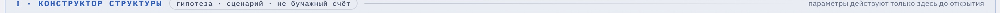
*Зона **Ⅰ · Конструктор структуры**: расчёт будущей позиции; изменения здесь не трогают уже открытую.*

P&L означает прибыль или убыток. Пока позиция открыта, итог включает текущую переоценку по рынку, а не только зафиксированный результат.

## 1. Быстрый старт

1. Откройте вкладку **«BTC-опционы»**.
2. В карточке **«Рыночные данные Deribit»** нажмите кнопку состояния источника. До запуска на ней написано **«НЕТ ДАННЫХ»**.
3. Дождитесь статуса **«LIVE»** и отметки времени UTC под карточкой.
4. Проверьте карточку **«IV-режим · сигнал входа»**. Низкий IV-ранг означает, что опционы относительно дешевы по сравнению с доступной недавней историей. Это не прогноз движения BTC.
5. Нажмите **«Старт (авто)»**. Проверьте параметры, состояние данных и причины проверки в тикете.
6. Нажмите **«Подтвердить · открыть структуру»**.
7. Следите за результатом и решениями в зоне **«Ⅱ · Хедж-движок · Paper Trading»**.

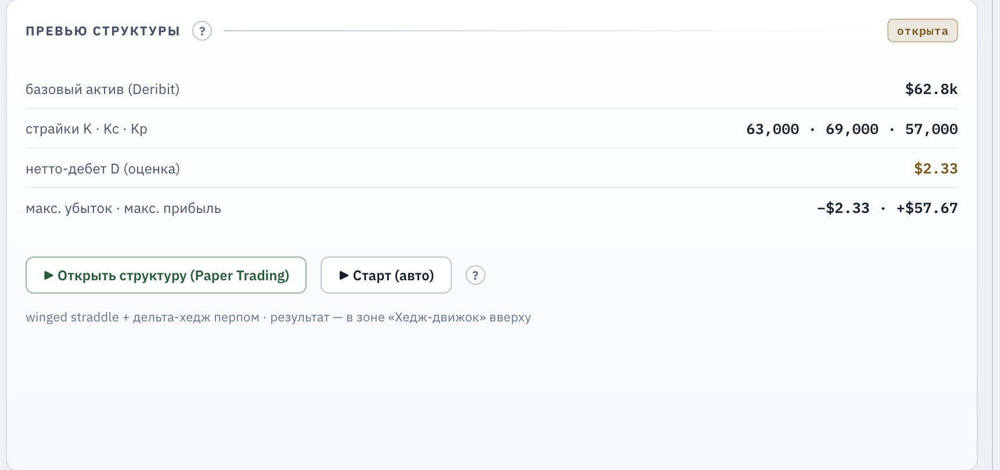
*Кнопки **«Старт (авто)»** и **«Открыть структуру (Paper Trading)»** — оба пути всегда открывают тикет подтверждения.*

## 2. Рыночные данные Deribit

При первом запуске приложения источник не включается автоматически. Нажатие кнопки состояния запускает опрос. Повторное нажатие запрашивает внеочередное обновление.

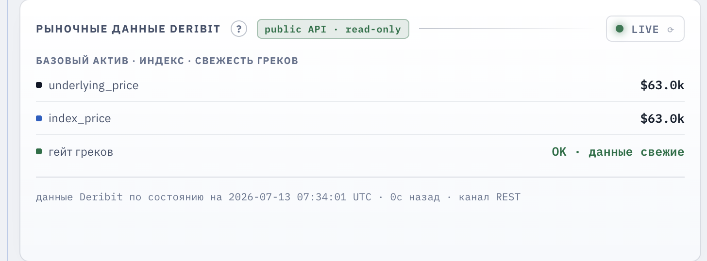
*Кнопка состояния источника (здесь **LIVE**), базовый актив/индекс, гейт греков и отметка времени UTC с каналом REST под карточкой.*

Селектор **«Реприс»** задает интервал опроса: 5, 15 или 30 секунд. Реприс означает получение новых цен и повторный расчет показателей. Это не временной триггер хеджа. Временной триггер является отдельным параметром движка и по умолчанию равен 60 секундам.

Статусы источника имеют следующие значения:

- **«НЕТ ДАННЫХ»**: источник не запущен.
- **«LIVE»**: последний снимок данных свежий, обязательные данные доступны.
- **«ПРЕДУПР.»**: источник работает, но вернул ошибку по части инструментов или не прошел гейт греков.
- **«УСТАРЕЛО»**: возраст последнего снимка превысил пять интервалов реприса, но не менее 15 секунд.

Под карточкой указаны время данных в UTC, их возраст и канал REST. Подсказка показывает сетевую задержку RTT и время обработки ответа Deribit.

Гейт греков проверяет наличие цены и греков для каждой ноги открытой структуры. Греки описывают чувствительность опциона к цене BTC, волатильности и времени. Если гейт не пройден, движок не создает новый хедж, а текущая переоценка опционов может быть неполной. Строка о непройденном гейте в тикете называет инструменты, по которым не хватает данных; полный список виден в подсказке при наведении. До восстановления LIVE не считайте P&L актуальной рыночной оценкой.

Фандинг представляет периодический платеж между длинной и короткой сторонами бессрочного фьючерса. Для открытого хеджа он может быть доходом или расходом и продолжает начисляться при плохом гейте, если ставка доступна.

Состояние позиции и журнал сохраняются при закрытии приложения. После следующего запуска источник нужно включить снова.

## 3. Параметры конструктора

Параметры структуры определяют, что будет открыто:

- **«Экспирация»**: одна из доступных дат в пределах трех дней.
- **«Офсет крыльев»**: целевое расстояние коротких страйков от ATM, 5%, 10% или 15%. Движок использует ближайшие доступные страйки Deribit.
- **«Кол-во контрактов»**: размер каждой ноги. Минимум равен 0.01, шаг равен 0.01.

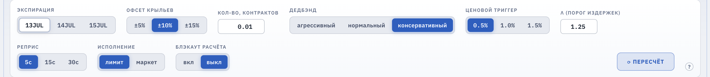
*Параметры структуры и хеджирования: экспирация, офсет крыльев, кол-во, дедбэнд, ценовой триггер, `λ`, реприс, исполнение, блэкаут.*

Параметры хеджирования определяют, когда движок рассмотрит новую сделку с перпетуалом:

- **«Дедбэнд»**: коридор общей дельты вокруг нуля. Пока дельта внутри, дельта-триггер не срабатывает. Пресеты задают ширину коридора: агрессивный ±0.0005 BTC, нормальный ±0.001 BTC, консервативный ±0.002 BTC. Открытая позиция продолжает работать со своей шириной; новый выбор применяется со следующего открытия.
- **«Ценовой триггер»**: минимальное изменение BTC с момента последнего хеджа, 0.5%, 1.0% или 1.5%.
- **`λ`**: запас над расчетными издержками. При `λ = 1.25` техническая оценка снижения ценового риска должна превысить издержки более чем на 25%. Это не прогноз прибыли.
- **«Исполнение»**: стиль бумажного исполнения хеджей. **Рыночное** исполняется сразу по цене встречной стороны, то есть пересекает спред, и платит комиссию 0.05%. **Лимитное** моделируется как исполнение по середине спреда с комиссией 0%: это компромисс — модель дает половину ценового преимущества пассивной заявки, но не моделирует риск, что реальная лимитная заявка не исполнится. Проскальзывание учитывается в фильтре решений в обоих режимах. Закрытие структуры всегда рыночное. Выбор применяется со следующего открытия.
- **«Блэкаут расчёта»**: запрет на открытие и пауза хеджирования с 07:50 до 08:10 UTC, а также в последние 30 минут до экспирации.

Кнопка **«Пересчёт»** обновляет доступные данные и строит новое превью.

При открытии структура и параметры решений движка сохраняются в позиции. Последующие изменения конструктора применяются к следующему открытию. Интервал реприса является настройкой источника и меняется сразу, в том числе при открытой позиции.

### Сигнал IV

IV, или подразумеваемая волатильность, отражает ожидаемый рынком диапазон движения цены, заложенный в стоимость опциона. Модуль рассчитывает ATM IV как среднее значений Deribit для ATM-колла и ATM-пута. Если доступна только одна нога, используется ее значение.

IV-ранг показывает положение текущей ATM IV между минимумом и максимумом доступных наблюдений в окне до 24 часов. Значение 0 соответствует минимуму, значение 1 максимуму. Сигнал появляется после 12 наблюдений, поэтому на новом профиле первое значение еще не описывает полный суточный режим. Вход считается благоприятным при ранге не выше 0.35.

DVOL является индексом 30-дневной подразумеваемой волатильности Deribit. Приложение загружает до 48 часов его истории. DVOL показан для контекста и не влияет на вердикт входа.

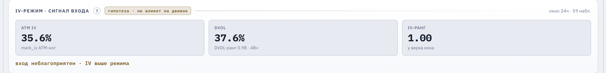
*ATM IV, IV-ранг и DVOL. Вход благоприятен при ранге ≤ 0.35 (здесь ранг 1.00 — вход неблагоприятен). DVOL показан для контекста и на вердикт не влияет.*

Сигнал IV не блокирует открытие и не меняет позицию.

### Превью и издержки

**«Payoff на экспирацию»** показывает расчетный P&L четырех опционов в дату экспирации для разных цен BTC. Он не включает результат перпетуального хеджа, его фандинг и комиссии. В центре максимальный убыток равен чистому дебету, то есть уплаченной премии за четыре ноги с учетом полученной премии за крылья. За короткими страйками прибыль ограничена. BE обозначает цену безубыточности.

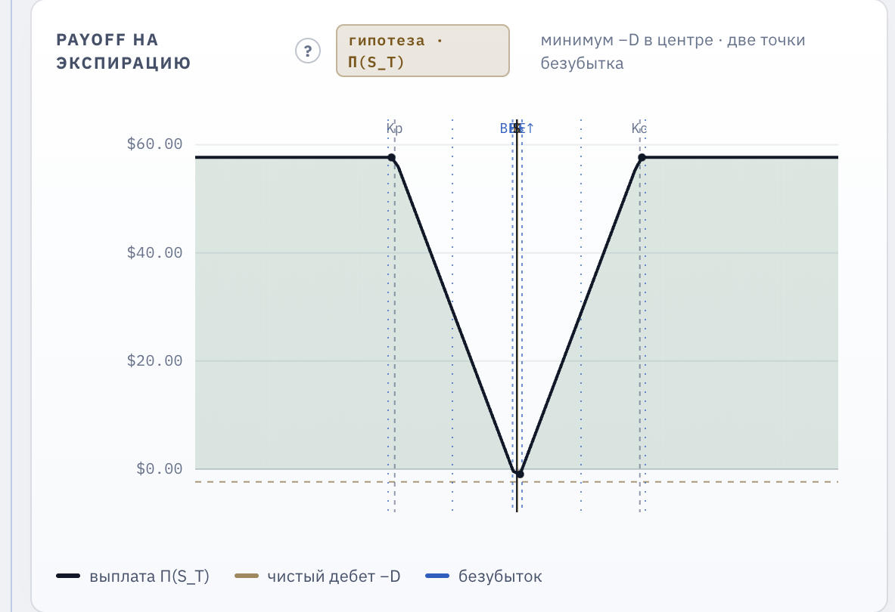
*Payoff четырёх опционов: максимум убытка в центре (чистый дебет −D), плато за короткими страйками, точки безубыточности **BE**. Хедж и его фандинг сюда не входят.*

**«Модель издержек хеджа»** сравнивает техническую оценку снижения дельта-риска с комиссией, половиной спреда, проскальзыванием и ожидаемым фандингом. Состав издержек следует за выбранным исполнением: при рыночном учитываются комиссия и полспреда, при лимитном обе эти статьи равны нулю, а проскальзывание остается в обоих режимах как минимальная цена сделки. Спред является разницей между лучшими ценами покупки и продажи; проскальзывание означает отклонение исполнения от расчетной цены. Полная оценка служит фильтром решения и не списывается из P&L одной операцией.

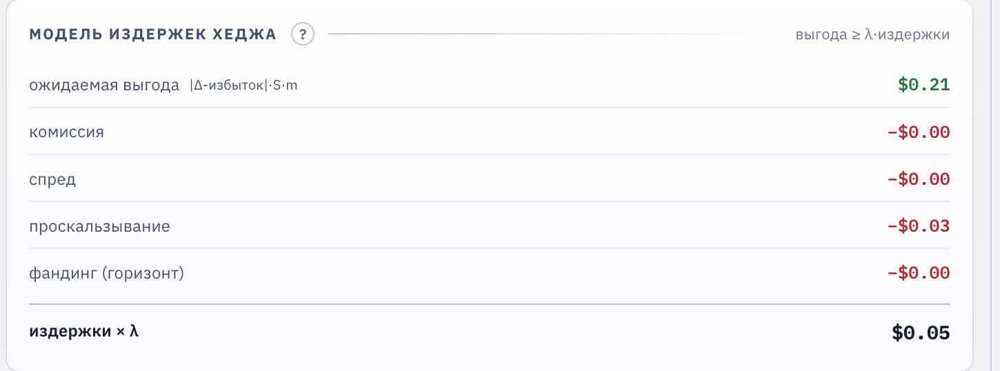
*Техническая оценка снижения дельта-риска против комиссии, полуспреда, проскальзывания и фандинга. Состав издержек следует за выбранным исполнением.*

## 4. Открытие структуры

Кнопка **«Открыть структуру (Paper Trading)»** использует выбранную экспирацию. Кнопка **«Старт (авто)»** выбирает ближайшую экспирацию в пределах трех дней, до которой осталось больше 30 минут. ATM и крылья выбираются как ближайшие доступные страйки к расчетным целям. Оба способа всегда открывают тикет подтверждения.

*«Открыть структуру» берёт выбранную экспирацию; «Старт (авто)» — ближайшую в пределах трёх дней (с запасом > 30 минут).*

Тикет показывает экспирацию, страйки, количество, параметры движка, дебет, максимальные прибыль и убыток, состояние данных и причины проверки.

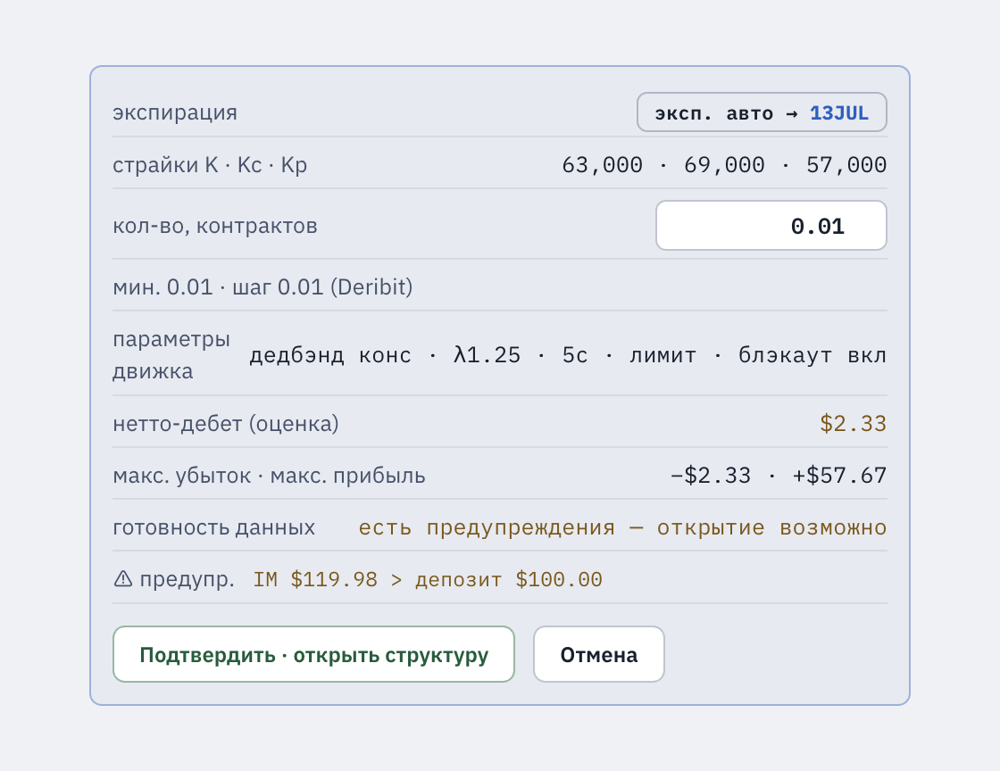
*Тикет подтверждения (раскрывается по «Старт (авто)» / «Открыть структуру»): экспирация с пометкой «авто», страйки K · Kc · Kp, количество, параметры движка, нетто-дебет, макс. убыток · прибыль, готовность данных и причины проверки. Кнопка **«Подтвердить · открыть структуру»** активна только при допустимом размере и пройденном гейте.*

Блокирующие причины запрещают открытие. К ним относятся неверный размер, несовпадающие данные ног и активный блэкаут. Equity представляет текущую стоимость бумажного счета: $100 плюс накопленный P&L. Предупреждение `IM > депозит` означает, что расчетная начальная маржа выше equity. Оно не блокирует paper trading, но такую позицию, вероятно, нельзя было бы открыть на реальном Standard Margin счете с теми же $100.

***Equity** = $100 + накопленный P&L. Предупреждение `IM > депозит` появляется, когда расчётная начальная маржа выше equity, но paper trading не блокирует.*

IM означает начальную маржу, требуемую для открытия. MM означает поддерживающую маржу, необходимую для удержания позиции. Приложение оценивает обе величины локально по формулам Standard Margin для коротких ног без взаимного зачета. Это не данные реального биржевого счета.

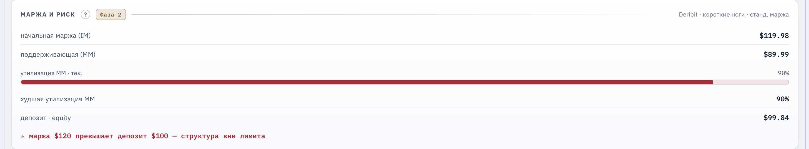
*Локальная оценка **IM** (начальная) и **MM** (поддерживающая) коротких ног по формулам Standard Margin — это не данные реального биржевого счёта.*

Кнопка подтверждения доступна только при допустимом количестве, свежих данных, пройденном гейте и отсутствии блокирующих причин. Процесс приложения повторно проверяет структуру, блэкаут и маржу, но не повторяет проверку свежести и гейта. Поэтому подтверждайте открытие только при положительном статусе данных в тикете. Клавиша Esc закрывает тикет.

## 5. Открытая позиция и решения движка

Карточка **«P&L счёта · атрибуция»** показывает:

- опционный результат: зафиксированный P&L закрытых структур плюс текущий MTM открытой структуры;
- результат перпетуала: зафиксированный P&L плюс текущий MTM открытой позиции;
- накопленный фандинг;
- накопленные комиссии;
- итоговый P&L как сумма результатов и фандинга за вычетом комиссий.

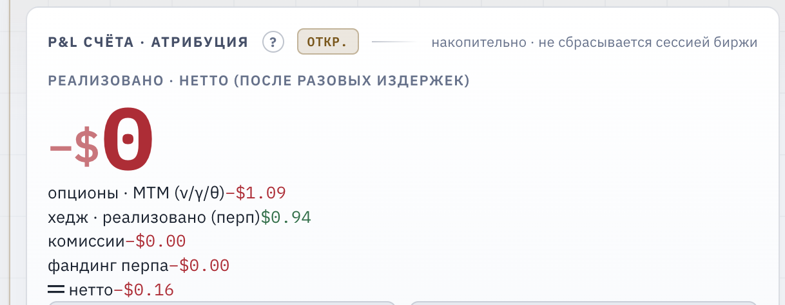
*Разложение итога: опционный результат (MTM), результат перпетуала, накопленный фандинг, комиссии → нетто-P&L.*

MTM, или mark-to-market, означает переоценку открытой позиции по текущей рыночной отметке. Опционные ноги учитываются по mark-цене без их комиссий и фактического спреда. P&L отдельно учитывает бумажные исполнения перпетуала, его комиссии и фандинг. Итог сохраняется после закрытия структуры и перезапуска приложения.

Карточка **«Греки и риск»** показывает дельту опционов, дельту перпетуала и их сумму `Total Δ`. Целевая дельта равна нулю. Дельта-избыток равен части абсолютной `Total Δ` за пределами дедбэнда. Гамма показывает, как быстро меняется дельта при движении BTC. Положительная вега означает выгоду от роста IV; отрицательная тета означает потерю стоимости со временем при прочих равных.

*Δ опционов, Δ перпетуала и их сумма `Total Δ` при цели 0; ниже — гамма, вега и тета всей позиции.*

На каждом цикле движок действует в таком порядке:

1. Проверяет блэкаут.
2. Проверяет дельта-триггер, ценовой триггер и временной триггер.
3. Округляет требуемый хедж до размера контрактов перпетуала.
4. Сравнивает ожидаемую выгоду с издержками, умноженными на `λ`.
5. Возвращает решение **«ХЕДЖ»**, **«ПРОПУСК»** или **«ПАУЗА»**.

**«ХЕДЖ»** означает бумажное исполнение сделки. Реальный ордер не отправляется. **«ПРОПУСК»** означает, что триггеры не сработали, размер округлился до нуля или фильтр издержек не пройден. **«ПАУЗА»** означает активный блэкаут.

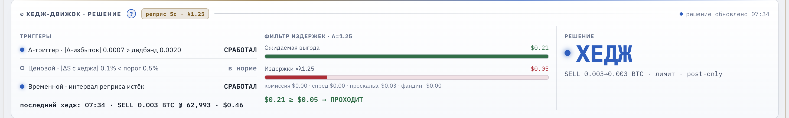
*Порядок цикла: блэкаут → триггеры (Δ / ценовой / временной) → округление до контрактов → фильтр издержек × `λ` → вердикт **ХЕДЖ / ПРОПУСК / ПАУЗА**.*

Графики показывают `Total Δ`, границы дедбэнда, накопленный P&L и цену BTC. Метки обозначают бумажные исполнения хеджа.

*`Total Δ` и границы дедбэнда; метки — бумажные исполнения хеджа. Рабочий хедж возвращает линию в коридор после каждой отметки.*

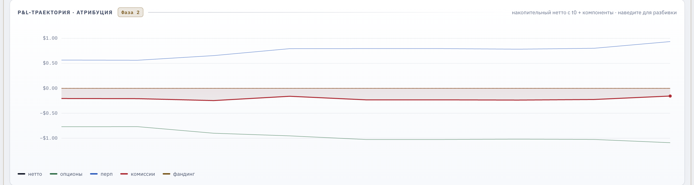
*Накопленный P&L по компонентам: нетто, опционы, перпетуал, комиссии, фандинг.*

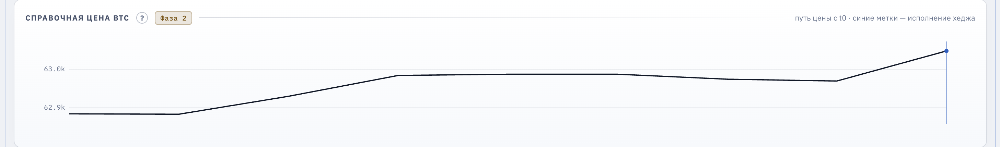
*Ход цены BTC за прогон; метки совпадают с исполнениями хеджа на графике дельты.*

## 6. Аналитика

**«Маржа и риск»** показывает локальную оценку IM и MM коротких ног, текущую долю MM в equity и максимальную долю за текущий прогон. Предупреждение включается при MM не ниже 80% equity. Если IM выше equity, структура помечается как выходящая за лимит, но paper trading остается доступен.

*Доля MM в equity и её максимум за прогон; предупреждение включается при MM ≥ 80% equity, метка «вне лимита» — при IM выше equity.*

**«Стресс-сценарии»** оценивают изменение P&L при движении BTC на 5% и 10%, изменении IV на 25 пунктов и утроенной ставке фандинга. Каждая строка указывает режим расчета: мгновенная оценка по грекам, payoff на экспирацию или расчет за горизонт. Это сценарии модели, а не прогноз.

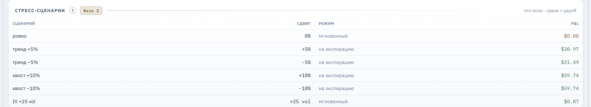
*Изменение P&L при движении BTC на ±5% / ±10%, сдвиге IV на 25 пунктов и утроенном фандинге. Каждая строка помечает режим расчёта. Это сценарии модели, не прогноз.*

**«Хедж vs без-хеджа»** сравнивает текущий итог с алгебраическим вариантом, где остается только опционная часть. Вклад хеджа равен P&L перпетуала плюс фандинг минус комиссии. Это не отдельный параллельный прогон.

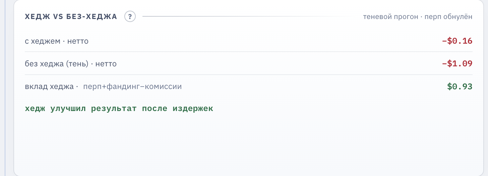
*Вклад хеджа = P&L перпетуала + фандинг − комиссии. Это алгебраический теневой прогон, а не отдельный параллельный движок.*

**«Метрики прогона»** используют изменение накопленного P&L в долларах между соседними тиками реприса. Sharpe равен среднему изменению, деленному на его стандартное отклонение, без аннуализации. Более высокое положительное значение означает, что средний прирост был больше относительно колебаний. Показатель зависит от реприса и короткого ряда, поэтому его нельзя сравнивать с дневным или годовым Sharpe другой стратегии. Также показаны доля положительных циклов, просадка, число и размер хеджей и максимальное отклонение дельты.

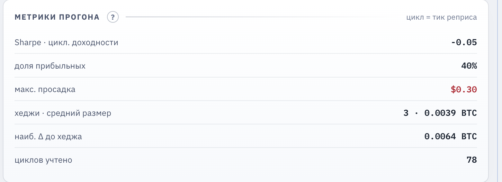
*Sharpe по тикам реприса без аннуализации (несравним с дневным/годовым), доля прибыльных циклов, просадка, число и размер хеджей, макс. отклонение дельты.*

## 7. Свип параметров

Свип означает перебор нескольких наборов параметров на ранее записанных снимках рынка. Он отвечает на вопрос, какие настройки дали лучший результат на сохраненном отрезке. Он не прогнозирует будущий результат.

Стандартная сетка содержит до 108 комбинаций крыльев, дедбэнда, ценового триггера и `λ`. Для каждой комбинации создается новый бумажный движок и воспроизводится один и тот же ряд снимков.

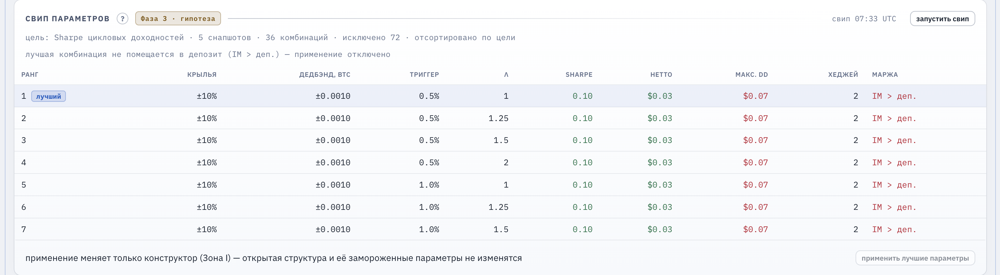
*До 108 комбинаций крыльев, дедбэнда, ценового триггера и `λ` на одних и тех же снимках. Сортировка: сначала соответствие марже, затем Sharpe, P&L и порядок сетки.*

В памяти хранится не более 600 снимков. Длительность ряда зависит от реприса: примерно 50 минут при 5 секундах, 2.5 часа при 15 секундах и 5 часов при 30 секундах, если каждый опрос создал снимок с опционами. История свипа очищается при перезапуске приложения.

Результаты сначала сортируются по соответствию маржинальному лимиту, затем по Sharpe, итоговому P&L и порядку сетки. Поэтому первая строка не обязательно имеет максимальный Sharpe среди комбинаций вне лимита.

Кнопка **«Применить лучшие параметры»** требует второго нажатия. Она меняет крылья, дедбэнд, ценовой триггер и `λ` в конструкторе. Открытая структура не меняется. Если все подходящие комбинации превышают маржинальный лимит, применение недоступно.

Пустая таблица означает, что снимков еще нет. Если все комбинации исключены, в первом снимке не было котировок выбранных ног. Подождите новые снимки и повторите свип.

## 8. Журнал и закрытие

Таблица **«Журнал хеджей и начислений»** содержит события `open`, `hedge`, `close-perp`, `close-options` и `settle-options` (расчёт на экспирации). Комиссия хранится в строках хеджа и закрытия перпетуала. Отдельных строк для комиссии и фандинга нет.

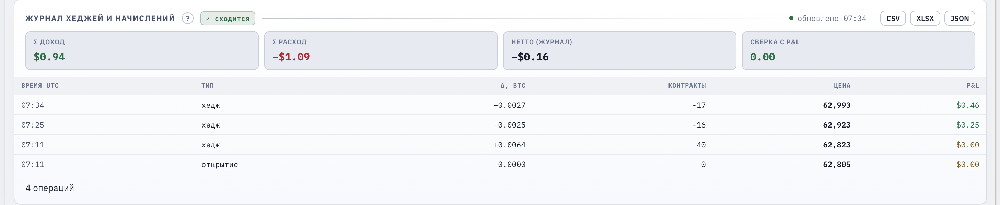
*События `open` / `hedge` / `close-perp` / `close-options` / `settle-options`; статус «сходится» и экспорт CSV, XLSX, JSON.*

Статус **«сходится»** проверяет арифметическое равенство компонентов P&L итоговому значению. Он не сверяет каждую строку журнала с P&L. Экспорт CSV, XLSX и JSON включает полный журнал независимо от показанных строк. Экспорт JSON и XLSX дополнительно содержит метрики прогона: текущего и последнего завершённого. CSV остается чистой таблицей событий.

Для закрытия нажмите **«закрыть структуру»** два раза в течение 3.5 секунды. Движок моделирует закрытие перпетуала по рынку и фиксирует текущий опционный MTM. Накопленный P&L не обнуляется. Источник продолжает получать данные для сигнала IV.

## 9. Файлы и ограничения

Данные хранятся в каталоге профиля BotLab:

- `btc-options.json`: структура, перпетуал, журнал, P&L и метрики;
- `btc-options-settings.json`: настройки;
- `btc-options-history.json`: история IV, до 24 часов.

Основные ограничения:

- Все исполнения расчетные. Модель не воспроизводит очередь заявок и фактическое проскальзывание; лимитное исполнение моделируется серединой спреда и не учитывает риск неисполнения заявки.
- Расчёт на экспирации использует индекс на момент расчёта как приближение расчётной цены Deribit — получасового среднего индекса перед 08:00 UTC — и не воспроизводит её точно.
- Дельта нейтрализуется только приблизительно и только на момент реприса. Гамма, вега и тета остаются.
- При перерыве в данных фандинг перпетуала начисляется максимум за 300 секунд. Остальная часть разрыва не восстанавливается и не записывается в журнал.
- Маржа является локальной оценкой Standard Margin без Portfolio Margin, то есть без зачета рисков между позициями, и без данных реального счета.
- Сигнал IV, стресс-сценарии и свип являются аналитическими оценками. Они не гарантируют прибыль.
- Кнопка `?` рядом с заголовком панели открывает справку по этой панели.

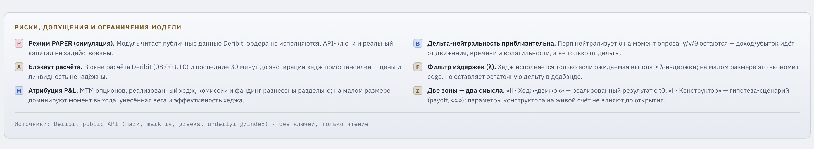
*Ключевые оговорки: все исполнения расчётные, расчёт на экспирации приближён по индексу, дельта нейтрализуется лишь на момент реприса, маржа локальная.*

## 10. Практикум: одна сделка от начала до конца

Раздел 1 «Быстрый старт» отвечает на вопрос, какие кнопки нажать. Этот раздел отвечает на вопросы «почему» и «когда»: как осознанно провести одну бумажную сделку и попытаться вырастить бумажный депозит $100. Напомним честно: это симулятор, реальные деньги не участвуют, а аналитика модуля не гарантирует прибыль. Практикум учит читать показания модуля и держать дисциплину процесса, а не предсказывать рынок.

### Шаг 0. Поймите, на чём вообще может вырасти бумажный депозит

Купленные колл и пут с одним страйком и одной экспирацией вместе называют стрэддлом. Купленный стрэддл похож на страховку от сильного движения в обе стороны: вы платите премию, то есть чистый дебет, и получаете выплату, если BTC к экспирации уйдет достаточно далеко от центрального страйка, неважно вверх или вниз. Проданные крылья удешевляют страховку, но ставят потолок выплаты. Из этого устройства следуют три источника роста депозита:

1. **Движение цены за безубыточность.** Точки безубыточности лежат по обе стороны от центрального страйка на расстоянии дебета в пересчете на размер позиции. Пересчет — это простое деление: разделите дебет на размер, $6 / 0.01 = $600 — настолько BTC должен уйти от центрального страйка в любую сторону, чтобы опционная часть на экспирации вышла в ноль. Если BTC ушел за одну из этих точек, опционная часть в плюсе. Но не дальше крыла: за коротким страйком кривая payoff плоская, и еще более сильное движение прибыль не увеличивает.
2. **Рост IV после входа.** Позиция с положительной вегой дорожает, когда рынок начинает ждать более сильных движений, даже если сама цена почти не сдвинулась. Стратегия входа заточена именно под это: сигнал считается благоприятным при низком IV-ранге, то есть когда страховка дешева относительно последних суток. Купили дешево, IV выросла, переоценка стала плюсом. Обратная сторона симметрична: падение IV после входа дает такой же минус.
3. **Гамма-скальпинг хеджем.** Целевая позиция перпетуала всегда равна дельте опционов с обратным знаком. Механически это означает: после роста BTC движок продает перпетуал, после падения откупает. Каждая пара «продал выше, откупил ниже» фиксирует небольшой плюс по перпетуалу (до комиссий). Эту тактику называют гамма-скальпингом: хедж перестраивается вслед за дельтой и превращает колебания цены в серию мелких фиксаций — без прогноза направления. Фандинг перпетуала при этом может быть как доходом, так и расходом, в зависимости от стороны позиции и знака ставки.

И три утечки, через которые депозит тает:

1. **Тета** — арендная плата за время. Каждый день владения купленными опционами стоит денег, даже если цена стоит на месте. В модели нет отдельной формулы распада: он приходит естественно, через снижение mark-цен ног при переоценке. Отрицательная суммарная тета в карточке **«Греки и риск»** означает, что при прочих равных позиция дешевеет с каждым днем.
2. **Штиль.** Если BTC к экспирации остался у центрального страйка, страховка не пригодилась: опционная часть теряет почти весь чистый дебет (ровно весь — при цене точно на страйке). Это максимальный убыток опционной части по построению, и это главный сценарий таяния депозита.
3. **Издержки хеджа.** Стоимость каждого бумажного исполнения перпетуала зависит от выбранного в конструкторе стиля исполнения (раздел 3). Рыночное платит комиссию 0.05% и пересекает спред: покупка по цене продавца, продажа по цене покупателя. Лимитное в модели дешевле — середина спреда и комиссия 0%, — но это плата моделью за риск, что реальная лимитная заявка не исполнится. В обоих режимах остается проскальзывание в фильтре решений, а закрытие структуры всегда рыночное. Убыток опционов ограничен дебетом, а издержки количеством сделок не ограничены. Именно поэтому в движке стоят дедбэнд и фильтр `λ`: они не дают хеджу «пилить» депозит мелкими сделками.

Вся сделка сводится к простому балансу: источники 1–3 должны принести больше, чем заберут утечки 1–3. Модуль показывает обе стороны баланса в карточке **«P&L счёта · атрибуция»**.

*Обе стороны баланса из шага 0 в живых числах: приток (перпетуал, фандинг) против утечек (комиссии и распад опционов в их MTM).*

### Шаг 1. Запустите данные и дождитесь LIVE

Включите источник и дождитесь статуса **«LIVE»** (как именно — раздел 1, пп. 2–3; расшифровка статусов — раздел 2). Смысл этого порядка простой: решение о сделке нельзя принимать по несуществующим или устаревшим ценам.

Если статус завис на **«ПРЕДУПР.»** или **«УСТАРЕЛО»**, нажмите кнопку источника еще раз — это внеочередной опрос — и проверьте интернет-соединение. Пока статус не **«LIVE»**, дальше не идите: все следующие шаги опираются на свежие данные.

### Шаг 2. Оцените сигнал IV

Откройте карточку **«IV-режим · сигнал входа»**. Вердикт входа появляется после 12 наблюдений (сам IV-ранг виден раньше, уже со второго); наблюдения записываются не чаще раза в 30 секунд, поэтому на свежем профиле первый вердикт возникнет примерно через шесть минут работы источника. История IV сохраняется на диск, так что после перезапуска приложения окно не начинается с нуля.

*Вердикт входа появляется после 12 наблюдений; сам IV-ранг виден раньше — уже со второго наблюдения.*

Порог благоприятного ранга и окно наблюдений описаны в разделе 3 «Сигнал IV». Здесь важно другое: сигнал не блокирует открытие — решение остается за вами. Если ранг высокий, честный вывод — подождать, а не открывать «потому что хочется».

### Шаг 3. Выберите размер и посмотрите на маржу честно

Размер задается полем **«Кол-во контрактов»** в конструкторе; проверить и поправить его можно и прямо в тикете подтверждения. По умолчанию стоит 0.01 контракта на ногу — это минимальный лот Deribit для этих опционов, меньше открыть нельзя: неверный размер — блокирующая причина. В практикуме оставьте 0.01.

Теперь арифметика, которую нужно принять заранее. Начальная маржа считается по двум проданным крыльям, и у нее есть пол, ниже которого она не опускается. Пример при цене BTC около $63,800 и размере 0.01 (у вас числа будут другими, но вывод сохранится): офсет крыльев 5% — IM около $131.5; 10% — около $121.8; 15% — около $117.8. Все три варианта выше депозита $100. Важна пропорция, а не конкретные доллары: один только пол маржи короткого колла равен примерно 10% текущей цены BTC на размере 0.01 — сравните его с депозитом $100 сами. Расширение крыльев с 5% до 15% снижает требование лишь на десятую часть, а более узкие крылья сделали бы маржу еще дороже (в интерфейсе офсетов ниже 5% нет).

*Начальная маржа считается по двум проданным крыльям и имеет пол; сравните её с депозитом $100 — обычно структура выходит за лимит.*

Вывод: при таких ценах BTC минимальная структура не помещается в $100 по правилам Standard Margin. Модуль сообщает об этом предупреждением `IM > депозит` и пометкой о выходе за лимит, но открытие в paper trading разрешает. На реальном Standard Margin счете с теми же $100 такую позицию, скорее всего, открыть было бы нельзя — маржа здесь локальная оценка по формулам Standard Margin, а не данные биржи (см. раздел 4). В симуляторе работайте минимальным размером 0.01 и не увеличивайте его — требование маржи растет пропорционально размеру.

После открытия следите за карточкой **«Маржа и риск»**: предупреждение включается, когда поддерживающая маржа достигает 80% equity (подробнее — раздел 6). Предупреждение информационное: в симуляторе принудительной ликвидации нет, позиция не закроется сама. Но понимать его нужно так: на реальном Standard Margin счете доля MM около 100% equity означала бы ликвидацию. Сработавшее предупреждение — веский довод рассмотреть закрытие по шагу 6, а не наблюдать дальше.

### Шаг 4. Откройте тикет и проверьте всё до подтверждения

Нажмите **«Старт (авто)»** — что именно выберет движок (экспирацию и ATM-страйки), описано в разделе 4. Подтверждение всегда идет через тикет — этот шаг не пропускается. В тикете проверьте по порядку:

1. **Экспирацию.** Авто-выбор виден в строке экспирации тикета как пометка «авто» (например, «эксп. авто → 12JUL»); ручная правка экспирации в конструкторе эту пометку снимает.
2. **Страйки.** Центральный страйк должен быть около текущей цены BTC, крылья — на выбранном офсете.
3. **«Нетто-дебет (оценка)»** — это тот самый чистый дебет из шага 0: цена вашей страховки и одновременно максимальный убыток опционной части. Спросите себя: готовы ли вы потерять эту сумму целиком в сценарии штиля.
4. **Макс. убыток и макс. прибыль.** Прибыль ограничена плато крыльев — сверхсильное движение сверх этого не прибавит.
5. **Готовность данных.** Подтверждайте только при строке **«гейт греков OK · данные свежие»**. Строки о блокировке или устаревших данных — повод нажать **«Пересчёт»**, а не продавливать открытие.
6. **Причины проверки.** Это отдельный список под строкой готовности. Пометка `✕ блок` запрещает открытие, `⚠ предупр.` — нет: предупреждения подтверждению не мешают. Предупреждение о марже из шага 3 появится именно здесь.

Не открывайте структуру в блэкаут (времена — в разделе 3); движок и сам не даст: это блокирующая причина.

*Тот самый тикет из шага 4. Строка **«есть предупреждения — открытие возможно»** и метка **⚠ предупр. IM $119.98 > депозит $100.00** — это ровно предупреждение о марже из шага 3: подтверждению оно не мешает (`✕ блок` запретил бы, `⚠ предупр.` — нет).*

### Шаг 5. Наблюдайте за движком, не мешая ему

После подтверждения работа переходит в зону **«Ⅱ · Хедж-движок · Paper Trading»**. Ваша роль — наблюдать и понимать, а не вмешиваться:

- Решение **«ПРОПУСК»** на большинстве циклов — норма, а не поломка. Полный список причин пропуска — в разделе 5; на размере 0.01 чаще всего срабатывает округление: хедж исполняется целыми контрактами перпетуала по $10, и требуемая поправка часто округляется до нуля. Каждый пропуск — это сэкономленные издержки исполнения.
- Когда насторожиться: если линия дельты подолгу стоит вне коридора, а решения — сплошной **«ПРОПУСК»**, сначала проверьте статус источника и гейт; при **«LIVE»** на размере 0.01 это обычно то самое округление — допустимо. Решение **«ПАУЗА»** означает блэкаут (времена — в разделе 3) и проходит само.
- Если статус источника ушел из **«LIVE»** в **«ПРЕДУПР.»** или **«УСТАРЕЛО»**, движок перестает создавать новые хеджи, а показанный P&L может быть неполным — это потеря свежей оценки, а не денег. Не принимайте решение о закрытии по замершим числам: нажмите кнопку источника для внеочередного обновления и дождитесь **«LIVE»**. Фандинг при этом продолжает начисляться.
- На графике **«Дельта и дедбэнд»** линия общей дельты должна возвращаться в коридор после каждой отметки исполнения. Так выглядит работающий дельта-хедж.
- Карточка **«P&L счёта · атрибуция»** показывает баланс из шага 0 в живых числах: опционы, перпетуал, фандинг, комиссии, итог.
- Карточка **«Хедж vs без-хеджа»** на крошечном размере часто показывает отрицательный вклад хеджа. Это не ошибка: хедж — страховка от направленного риска, и у страховки есть цена.
- Менять параметры конструктора во время прогона бесполезно для открытой позиции: они заморожены при открытии (раздел 3) и изменятся только со следующей структурой.

*Так выглядит работающий дельта-хедж: линия `Total Δ` возвращается в коридор дедбэнда после каждой отметки исполнения.*

### Шаг 6. Закройте сделку осознанно

У сделки два честных финала. Первый — досрочное закрытие кнопкой: вы фиксируете текущую переоценку. Второй — расчёт на экспирации: если позиция дожила до даты экспирации, симулятор сам рассчитает опционы по внутренней стоимости на цене индекса, выровняет перпетуал и запишет в журнал событие «расчёт на экспирации». Цена расчёта — текущий индекс на момент расчёта; это приближение реальной расчётной цены Deribit (там берется получасовое среднее индекса перед 08:00 UTC), о чем прямо сказано в примечании строки журнала. Если приложение было закрыто в момент экспирации, расчёт произойдет на первом же живом снимке после запуска — по индексу на тот момент, с пометкой опоздания.

Держать до расчёта — это ставка на форму выплаты из шага 0 целиком; закрывать раньше — управление риском тета и IV. В последние 30 минут до экспирации движок не хеджирует (блэкаут), так что дельта в этот отрезок дрейфует без присмотра.

Модуль не закрывает позицию за вас — момент выхода выбираете вы. Ориентиры следуют из шага 0:

- **BTC дошел до крыла или ушел за него.** Опционная прибыль уперлась в плато и от дальнейшего движения не вырастет — держать позицию ради опционов больше незачем.
- **IV заметно выросла после входа.** Часть плана «купил дешевую волатильность» уже исполнилась, и переоценка это отражает. Рост IV — это переоценка, а не зафиксированный результат: зафиксирует его только закрытие.
- **IV упала после входа.** Тезис «купили дешевую волатильность» не подтвердился, переоценка в минусе; держать дальше — ставка на то, что сильное движение все же случится до экспирации. Решите до входа, какой минус вы готовы принять, и закрывайте по этому порогу, а не по настроению.
- **Штиль при близкой экспирации.** Если цена стоит у центрального страйка, каждый час аренды приближает потерю всего дебета. Досрочное закрытие спасает остаток премии, который еще не съела тета; дожидаться расчёта в штиль — значит отдать дебет целиком.
- **Если решили держать до расчёта** — примите заранее, что последние 30 минут дельта не хеджируется (блэкаут), а расчётная цена симулятора — приближение по индексу, а не биржевое получасовое среднее.

Для закрытия нажмите **«закрыть структуру»** (кнопка требует двойного нажатия — детали в разделе 8). Движок выровняет перпетуал в ноль по рынку с комиссией и зафиксирует текущую опционную переоценку. Накопленный P&L не обнуляется: он переносится в equity и переживает перезапуск приложения.

*Закрытие — двойное нажатие **«закрыть структуру»** в полосе зоны Ⅱ в течение 3.5 секунды.*

### После сделки: журнал, метрики, свип

Одна сделка мало что доказывает. Ценность практикума — в цикле обучения:

1. **Экспортируйте журнал** (CSV, XLSX или JSON — экспорт всегда полный) и разберите его: сколько было хеджей и сколько ушло на комиссии (комиссия хранится в строках хеджа и закрытия перпетуала). Накопленный фандинг в журнал не пишется — его смотрите в карточке **«P&L счёта · атрибуция»**.
2. **Метрики прогона не теряются.** При закрытии или расчёте структуры модуль замораживает сводку завершённого прогона; экспорт в JSON и XLSX содержит и её, и метрики текущего прогона (в CSV метрик нет — он остается чистой таблицей событий). Смотрите на долю прибыльных циклов, просадку и число хеджей. Sharpe здесь считается по циклам и без аннуализации — почему его нельзя сравнивать с дневным или годовым Sharpe других стратегий, объясняет раздел 6.
3. **Запустите свип** (подробно — раздел 7). Он прогонит те же записанные снимки через тот же движок с разными комбинациями настроек и покажет, какие дали бы лучший результат на этом отрезке. Кнопка **«Применить лучшие параметры»** (тоже требует второго нажатия) переносит их только в конструктор — открытая позиция и депозит не меняются. И главное ограничение: это прошлое, не прогноз.
4. **Откройте следующую структуру через тикет** с уточненными параметрами — и повторите цикл. Equity равен $100 плюс весь накопленный итог (раздел 4), так что каждая сделка продолжает предыдущие, а не начинает с чистого листа.

*После сделки разберите журнал: сколько было хеджей и сколько ушло на комиссии (экспорт всегда полный — CSV / XLSX / JSON).*

*Свип прогонит записанные снимки через тот же движок с разными настройками и покажет, какие дали бы лучший результат на этом отрезке. Это прошлое, не прогноз.*

Если серия сделок уменьшила equity, это не сбрасывается: следующая структура открывается на меньший счет, и предупреждение `IM > депозит` станет только заметнее. Принудительной ликвидации в симуляторе нет — позиция не закрывается сама, даже если поддерживающая маржа превысит equity. Сбросить бумажный счет из интерфейса нельзя. Честная практика — продолжать минимальным размером и разбирать журнал, а не пытаться «отыграться» увеличением размера.

### Чего практикум не обещает

Честные оговорки в конце:

- Это paper trading. Модель не учитывает комиссии и спред опционных ног и фактическое проскальзывание исполнения — реальная торговля с теми же параметрами была бы дороже бумажной.
- Сигнал IV, стресс-сценарии и свип — оценки на уже случившихся данных. Ни одна из них не предсказывает будущее движение BTC или IV.
- «Вырастить депозит» здесь означает одно: увеличить бумажные $100 в симуляторе. Отдельная сделка может закончиться как угодно даже при правильных действиях. Практикум тренирует не результат, а процесс: входить по данным, а не по настроению, понимать источники и утечки P&L и фиксировать выводы после каждой сделки.
