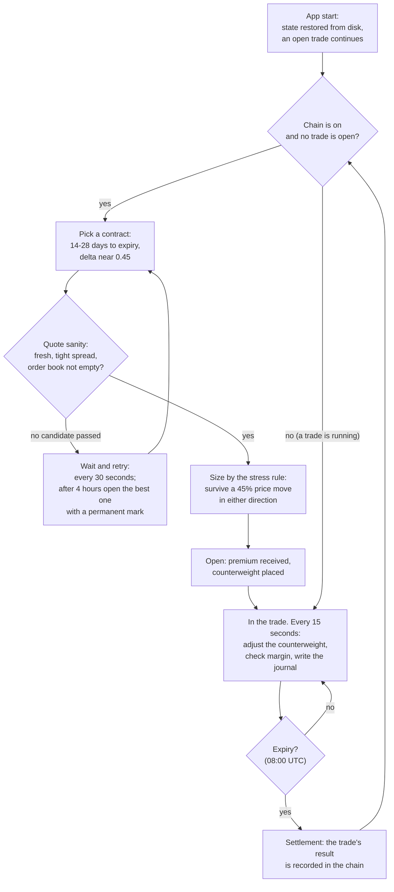
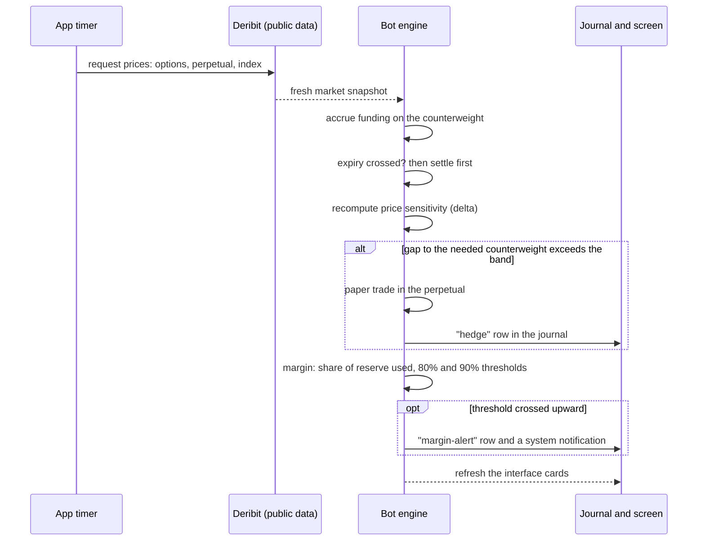
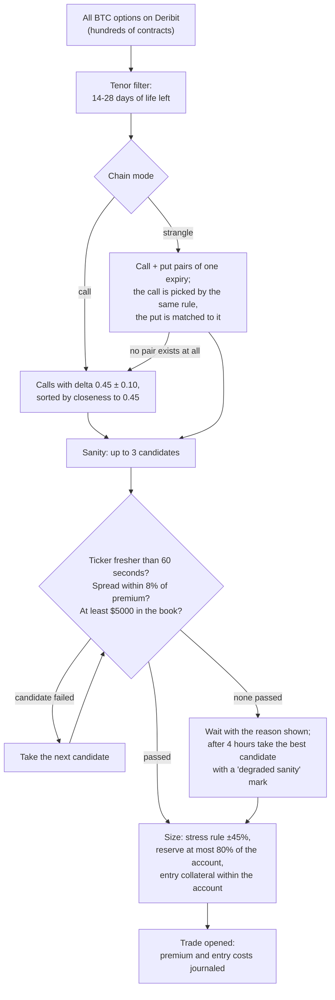
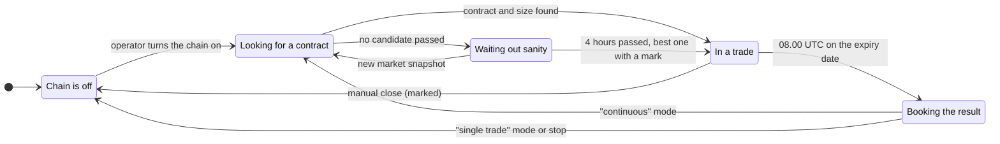
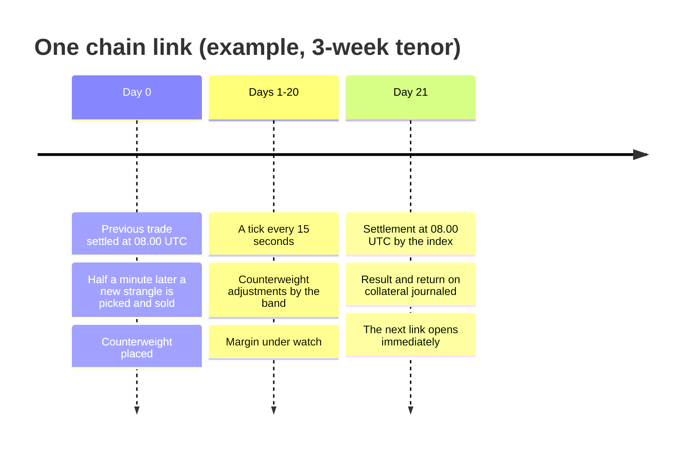
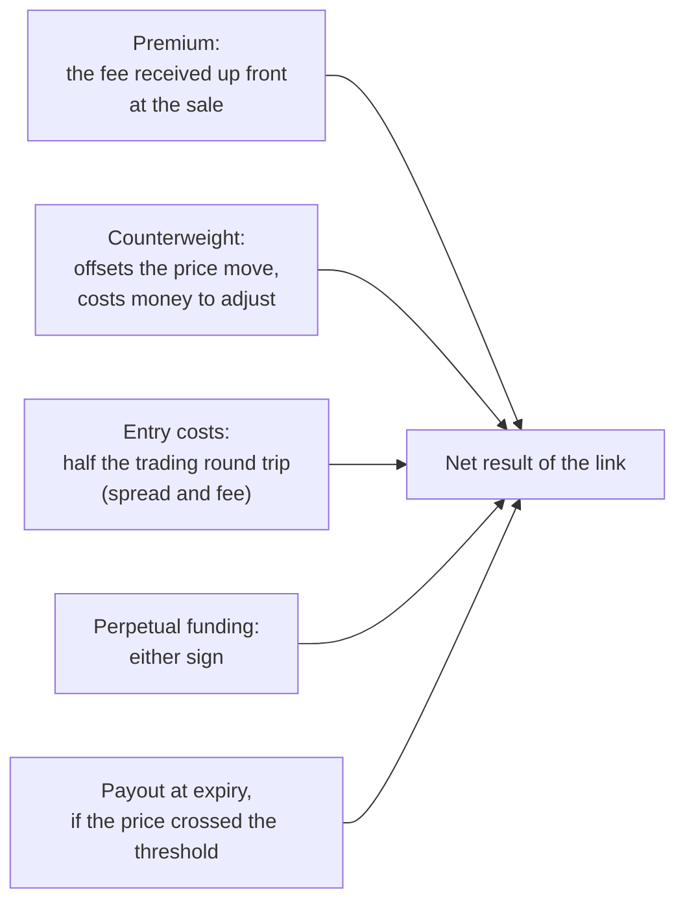

# Bot 2 "BTC Options": How It Works

A plain-language explanation of the bot's mechanics for a reader with no trading or
options background: what the bot does, when, and why, across its whole life cycle.

[Русская версия](bot2-btc-options-how-it-works.ru.md) · Document matches the code as of 2026-08-27.

**Important.** The bot trades on paper only. No real money moves, no orders are sent to
the exchange, and the app holds no account keys. It reads public market data from the
Deribit exchange and honestly simulates what would happen to an account. It is a research
tool, not investment advice; no profit is promised.

---

## The Gist in 30 Seconds

Bot 2 works like a small insurance company.

- It **sells insurance against large moves in the Bitcoin price**. Such an insurance
  contract is called an option: the buyer pays a fee (the premium) up front, and the
  seller promises a payout if the price crosses an agreed threshold by an agreed date.
- As long as the price has not "blown through", the premiums stay with the seller. On
  average the market pays more for fear than the actual storms end up costing, and that
  difference is what the bot earns.
- To avoid betting on price direction, the bot keeps a **counterweight**: a position in a
  perpetual futures contract that it adjusts as the market moves. This is called
  delta hedging.
- Every two to four weeks the insurance expires. The bot books the result and immediately
  sells the next one: a continuous **chain** of trades.

The bot does all of this by itself: picks the contract, computes a safe size, watches the
risk, and keeps a journal. The operator turns the chain on and observes.

---

## The Whole Life Cycle

Six steps, one line each; details in the sections below.

1. **Start.** The app restores its saved state from disk: the open trade, the
   counterweight, the journal and the settings all survive a restart.
2. **Tick.** Every 15 seconds the bot takes fresh Deribit data and runs one decision
   cycle. Everything else happens inside ticks.
3. **Opening.** When the chain is on and no trade is open, the bot picks a contract,
   checks quote quality and computes the size. Opening records the premium and the
   entry costs.
4. **Holding.** Until expiry the bot keeps the counterweight inside a band and watches
   the margin. The scheme has no early exits.
5. **Expiry.** At 08:00 UTC on the expiry date the insurance settles automatically; the
   trade's result is recorded in the journal and in the chain history.
6. **Re-entry.** On the very next tick the bot is already looking for a new contract.
   The chain lives on until the operator stops it.

---

## Every 15 Seconds: the Tick

One tick is one full "look, decide, record" cycle. The interval is configurable
(5, 15 or 30 seconds; 15 by default).

What matters about ticks:

- **Public data only.** The bot requests option, perpetual and index prices; it sends
  nothing and never authenticates.
- **Bad data never trades.** If the snapshot is incomplete (no perpetual price, no
  greeks), the bot skips the decision instead of acting blindly.
- **Polling runs only while there is something to watch.** With an open trade or an armed
  chain it starts by itself (including after a restart); with neither, the bot stays
  silent and off the network.
- **Interruptions are visible.** A sleeping computer, a network outage or app downtime is
  recorded as a gap with its cause; per-trade tick coverage is shown to the operator.
  Funding over a long gap is honestly marked as not accrued rather than back-filled.

---

## How the Bot Opens a Trade

**What is sold.** In "call" mode, one insurance against a strong rise. In "strangle"
mode, two insurances of the same date at once: against a rise (a call) and against a fall
(a put). The two premiums add up, yet the pair still has only one dangerous scenario: the
price can move far in only one direction. The pair's stress size is therefore set by the
worse side, not by the sum, and the income per unit of tail risk comes out higher, which
the five-year historical measurement confirmed. This is the chain's main mode. If no pair
exists on the market at all, the bot sells a single call and honestly marks the trade as
a call.

**Why delta 0.45.** Delta measures how strongly the insurance price reacts to Bitcoin's
moves; it also doubles as a rough probability of payout. 0.45 means "the payout threshold
is not far from the current price": such insurance is expensive, and its premium is the
most overpriced. The number was verified by a historical sweep, as was the 14-28 day
tenor window.

**Sanity: why the bot may wait.** Only a live contract is worth selling: the quote must
be fresher than 60 seconds, the gap between buy and sell prices no wider than 8% of the
premium, and the order book must hold at least $5000 on each side. If a candidate fails,
the next-closest-delta one is tried; if none passes, the bot waits and shows the reason.
If the wait exceeds 4 hours, a broken chain is judged costlier than an imperfect quote:
the best available candidate is opened, and the trade permanently carries a
"degraded sanity" mark.

**Size: the stress rule.** Before opening, the bot asks: "if the Bitcoin price jumped 45%
up or down, how much reserve would the exchange demand?" It then takes only as many
contracts as keep that reserve within 80% of the account even in that case. The binding
side is wherever the reserve grows faster: the upside for a call, the downside for a put,
the worse of the two for a pair. On top of that sits the exchange's own limit: entry
collateral may not exceed the account. The numbers 45 and 80 are not operator settings
but constants of the scheme, fixed by a five-year measurement (45% reads as "survive a
repeat of the worst observed move"). The operator never has to choose a size.

---

## Life Inside the Trade: the Counterweight (Delta Hedge)

A sold insurance makes the account price-sensitive: a short call loses when the price
rises, a short put when it falls. The bot removes that sensitivity with a counterweight,
a position in the BTC-PERPETUAL futures contract.

There is exactly one rule, and it is simple:

- on every tick the bot computes **what counterweight is needed now** (from the total
  delta of the sold legs);
- compares it with **what is currently held**;
- if the gap exceeds the band of **0.03 BTC per contract**, it adjusts; otherwise it
  does nothing.

No schedules, no price triggers, no "is it worth it right now" filters: measurements
showed the band decides, not the checking frequency. (The manual four-leg mode does have
time and price triggers and a benefit filter, configurable in the toolbar; the seller
scheme switches them off deliberately, because that is how it was measured.) An adjustment is modeled as a limit
order at the middle of the spread (maker fee 0%); if the operator selected "market", it
crosses the spread and pays the taker fee. The perpetual carries funding, small periodic
payments between buyers and sellers; the bot accrues it every tick, in either direction.

**There are no exits before expiry.** No stop-losses, no take-profits: all of the
scheme's statistics were taken with a single exit, living until expiry, and the project's
sweeps of early exits produced not a single profitable configuration. A trade can be closed manually, but it is then
permanently marked as closed early and kept apart from the measured statistics.

---

## Protection: Margin

The exchange requires a reserve (margin) to be held against sold insurance. On a real
account, a reserve that consumes the whole account means forced position closure,
liquidation. The bot computes the reserve with the exchange's own formulas and answers
three questions on every tick:

1. **How much reserve is required right now** and what share of the account it occupies
   (utilisation).
2. **At what Bitcoin price the reserve would equal the account**: the liquidation price
   estimate, shown on the margin card and as the LIQ mark on the payoff chart.
3. **Whether an alert threshold was crossed.** 80% filled is the first level, 90% the
   second. Each upward crossing writes a journal row and fires a system notification. To
   keep jitter around a threshold from spamming alerts, a level is only released after
   utilisation retreats 5 points below it (hysteresis).

The stress sizing rule (above) and the margin alerts are two halves of one protection:
the first refuses a dangerous size at entry, the second watches the risk as the trade
runs.

---

## Expiry and Re-entry

The chain card shows these states as tokens (off, picking, in trade, settling, stopping,
halted); the red "halted" token means the size does not fit the account.

**Settlement.** Deribit options expire at 08:00 UTC. The first tick past that moment
settles the insurance automatically: if the price stayed on the "safe" side of the
threshold, there is no payout and the whole premium is kept; if it crossed, the bot pays
the difference. Settlement uses the index price (an honest proxy of the exchange's
official price); the official one is published later, and when it arrives the trade's
result is corrected by an adjustment. The counterweight is closed at market. If the app
was off at the expiry moment, settlement runs at the next start and is marked as late.

**The trade's result** goes into the chain history: premium, costs, funding, outcome and
return on collateral, the same measure the scheme was evaluated with historically.

**Re-entry.** On the very next tick the bot looks for a new contract (retrying every
30 seconds on failure). The "stop" button abandons nothing: the current trade lives to
its expiry, and no new one opens. "Single trade" mode runs exactly one link and stops.

One chain link, by example:

---

## Where the Result Comes From and What Can Go Wrong

A trade has one source of income, the premium. Against it stand four items: the payout at
expiry (if the price crossed the threshold), the entry costs, the cost of counterweight
adjustments, and funding (which can also be income). The counterweight absorbs most of
the price move, but a sharp move still hurts: adjustments during a fast move cost money
themselves, and the required reserve grows. That is exactly why the size is computed with
a ±45% stress and the margin sits under a permanent alarm system.

Honestly about risk: the scheme was tested by replaying five years of history and earned
on average, but individual trades lost, and drawdowns were real. A paper result is not a
promise about the future.

---

## The Full Feature Surface

The tab has two zones: "Hedge engine · Paper Trading" (the live trade, the chain, the
journal) and "Structure constructor" (scheme choice, preview, launch).

| Feature | What it does |
|---|---|
| Seller chain | The main mode: continuously sell and manage trades; "continuous" and "single trade" modes; stop with live-out |
| Scheme selector | Three structures: "4 legs" (the tent), "sell call", "strangle"; the pair falls back to a call when no put exists; switching is blocked while a trade is open |
| Autonomous sizing | The ±45% / 80%-of-account stress rule; no operator size number in the chain |
| Leg sanity | Quote freshness, spread, book depth; a veto switches the candidate; 4-hour waiting window |
| Delta hedge | A perpetual counterweight with a 0.03 BTC-per-contract band, limit orders at mid |
| Margin monitor | Reserve utilisation, liquidation price estimate, 80/90 alerts with hysteresis, system notifications |
| Journal (ledger) | Every event as a row: open, entry costs, hedges, funding gaps, margin alerts, settlement, delivery adjustment; CSV, XLSX and JSON export |
| Conformance passport | A row-by-row comparison of the trade's frozen configuration against the measured scheme: band, triggers, blackout, tenor, sizing rule, exit |
| Chain history | Each link's outcome: premium, costs, return on collateral, "early close" and "degraded sanity" marks |
| Tick coverage | Polling continuity per trade; gaps recorded with their cause (sleep, app downtime, no response) |
| Payoff chart | "What happens at expiry at price X" with entry, current price and LIQ marks |
| Stress scenarios | Instant "what if price or volatility jumped right now" recomputation |
| Manual constructor | The bot's original scheme: a four-leg "tent" (buy a straddle, sell wings 5-15% away), opened manually |
| Auto expiry pick | For the manual tent: the nearest live expiry within 3 days |
| IV signal | For the tent: a hint that entry is favorable when the 24-hour volatility rank is low |
| Sweep | A grid sweep over tent configurations with a score for each |
| Hedge-vs | A shadow book "what if there were no hedge": the counterweight's net contribution shown separately |
| Run metrics | Sharpe, hit rate, drawdown and more for the current trade; a frozen summary of the previous one |
| Persistence | All state on disk: a restart resumes the trade, the journal and the chain where they left off |
| Paper account | The starting deposit is configurable ($100 by default); equity = deposit + accumulated result |
| Testnet | The data source can be switched to test.deribit.com (a settings-file key, no toolbar control) |

---

## What the Bot Does Not Do

- **It does not predict the price or time the market.** Re-entry happens right after
  settlement: every "good moment" filter tried on history only made things worse.
- **It does not place stops or take-profits.** The only measured exit is to live until
  expiry; early exits produced no profitable configuration on history.
- **It does not send real orders.** Paper simulation on live public data only; the app
  has no keys and no access to money.
- **It does not guarantee profit.** It shows the model's honest result, losses included.

---

## Glossary

| Term | In plain words |
|---|---|
| Option | Insurance against a price move: the buyer pays a fee, the seller promises a payout if the price crosses a threshold by a date |
| Premium | The insurance fee; the seller receives it up front |
| Call | Insurance against a price rise |
| Put | Insurance against a price fall |
| Strangle | A call + put pair of the same date: insurance against both sides at once |
| Strike | The threshold where the insurance starts paying out |
| Expiry | The date and moment the insurance ends (always 08:00 UTC on Deribit) |
| Delta | How strongly the insurance price reacts to Bitcoin's moves; a rough probability of payout |
| Perpetual | A futures contract on Bitcoin with no expiry; the bot uses it as the counterweight |
| Delta hedge | Holding a counterweight sized so the account does not depend on price direction |
| Band | The tolerated gap between the needed and the held counterweight; inside the band the bot does not trade |
| Funding | Periodic payments between perpetual buyers and sellers; the sign varies |
| Margin (reserve) | The amount the exchange requires to be held against sold insurance |
| Utilisation | The share of the account occupied by the required reserve |
| Liquidation | Forced closure of positions on a real account when the reserve consumes the account |
| IV | The storm the market expects: the volatility priced into the insurance |
| Lot | The minimum option size step (0.01 contracts) |
| Paper trading | Simulation on live data with no real orders or money |

---

## Code Map (for the Curious)

| Module | Role |
|---|---|
| `src/engine/btcopt/engine.js` | The heart: the tick, open/settle, the chain, margin alerts |
| `src/engine/btcopt/structure.js` | Structure builders: tent, sell-call, strangle; the selection funnel and sizing |
| `src/engine/otmscan/sellhedge.js` | The seller scheme's rules: tenor window, delta, band, re-entry |
| `src/engine/otmscan/sellstrangle.js` | Pair rules: matching a put to the call, pair entry |
| `src/engine/otmscan/sanity.js` | Quote sanity: freshness, spread, depth; the waiting window |
| `src/engine/btcopt/margin.js` | The exchange's margin formulas, liquidation price estimate, stress sizing |
| `src/engine/btcopt/hedge.js` | The counterweight decision and the execution model |
| `src/engine/btcopt/pnl.js` | Accounting: options, perp, funding, fees, the journal |
| `src/engine/btcopt/payoff.js` | The at-expiry payoff chart |
| `src/engine/btcopt/metrics.js`, `stress.js`, `regime.js`, `sweep.js` | Run metrics, stress scenarios, the IV signal, the sweep |
| `src/engine/btcopt/deribit.js` | Public Deribit data supply |
| `src/main/main.js` | The polling timer, persistence, system notifications, UI wiring |
| `src/renderer/index.html` | The tab's interface |
