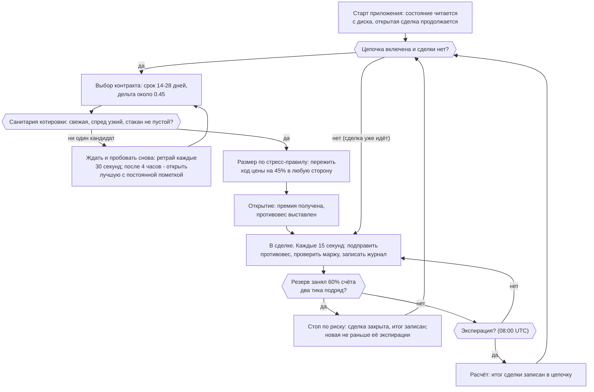
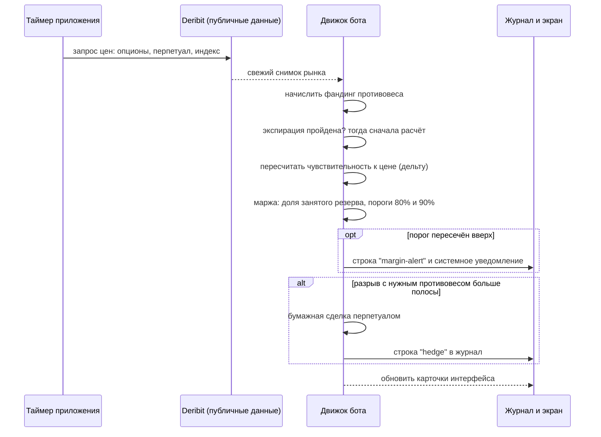
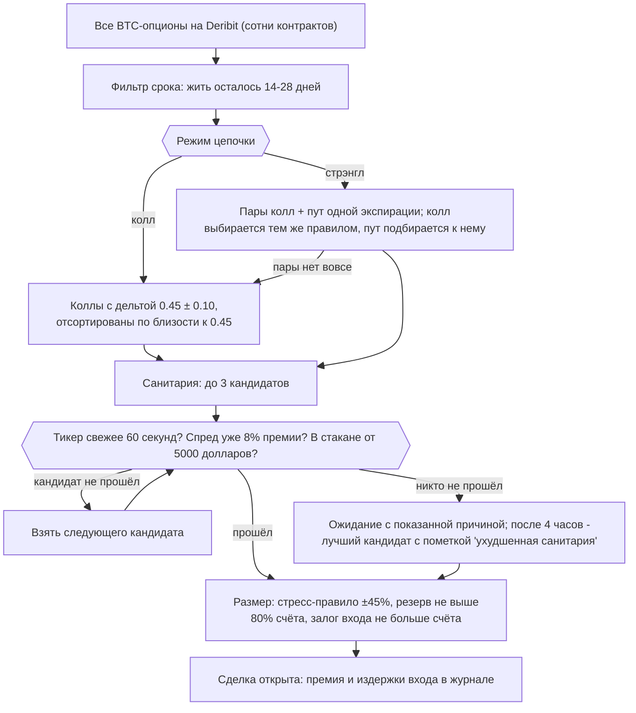
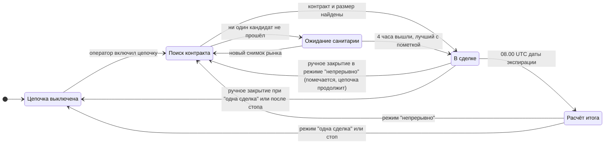
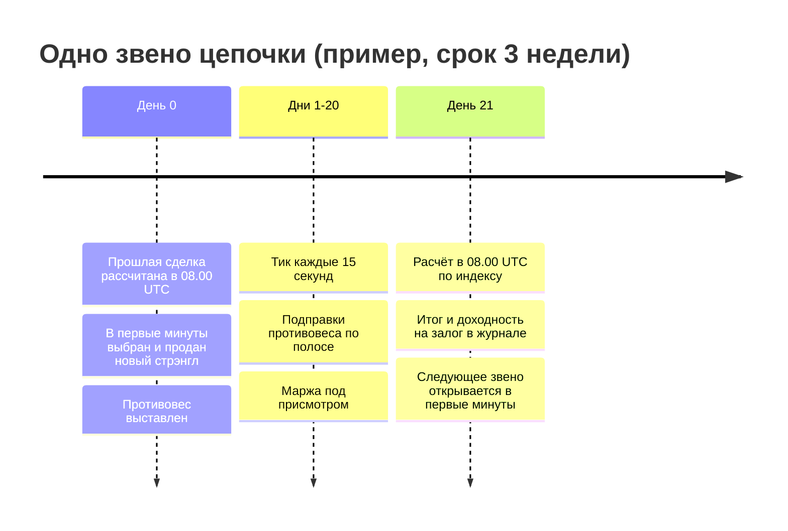
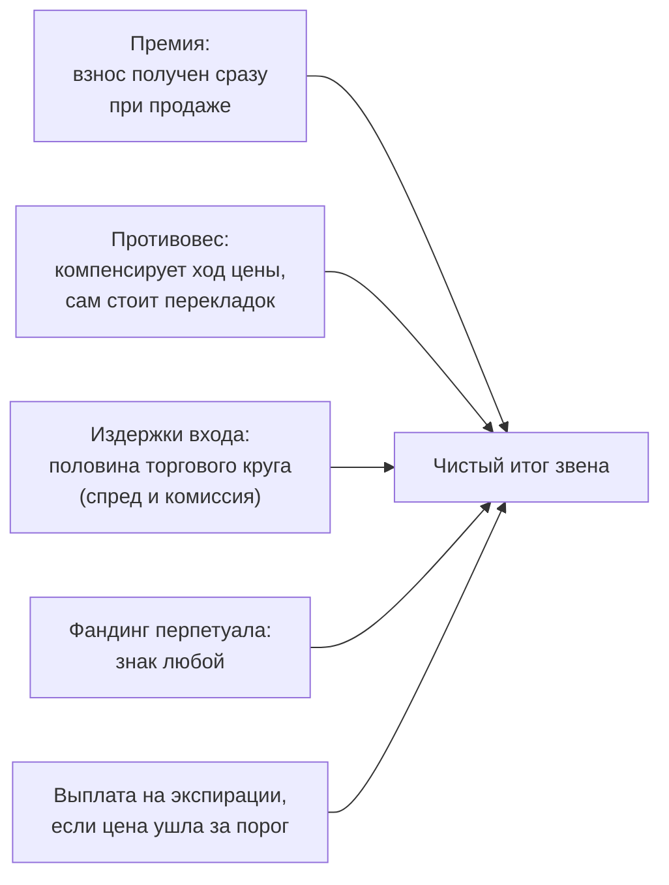

# Бот 2 «BTC-опционы»: как он работает

Что бот делает, когда и зачем - весь цикл жизни, от выбора контракта до расчёта и
перевхода. Термины поясняются по ходу текста, словарик и карта кода - в конце.

[English version](bot2-btc-options-how-it-works.en.md) · Документ соответствует коду на 05.09.2026.

**Важно.** Бот торгует только на бумаге. Реальные деньги не двигаются, заявки на биржу не
отправляются, ключей от счёта у приложения нет. Он читает публичные рыночные данные биржи
Deribit и честно моделирует, что происходило бы со счётом. Это исследовательский
инструмент, а не инвестиционный совет; прибыль не обещается.

---

## Суть за 30 секунд

Бот 2 работает как маленькая страховая компания.

- Он **продаёт страховки от сильных движений цены биткоина**. Такая страховка называется
  опционом: покупатель платит взнос (премию) сразу, а продавец обещает выплату, если цена
  к оговорённой дате уйдёт за оговорённый порог.
- Пока цена «не улетела», взносы остаются у продавца. Рынок в среднем платит за страх
  больше, чем потом стоят фактические бури, и на этой разнице бот зарабатывает.
- Чтобы не ставить на направление цены, бот держит **противовес**: позицию в бессрочном
  фьючерсе, которую подправляет вслед за рынком. Это называется дельта-хедж.
- Каждые две-четыре недели страховка истекает. Бот подводит итог и сразу продаёт
  следующую: получается непрерывная **цепочка** сделок.

Всё это бот делает сам: выбирает контракт, считает безопасный размер, следит за риском и
ведёт журнал. Оператор включает цепочку и наблюдает.

---

## Жизненный цикл целиком

Шесть шагов одной строкой каждый; подробности в разделах ниже.

1. **Старт.** Приложение поднимает сохранённое состояние с диска: открытая сделка,
   противовес, журнал и настройки переживают перезапуск.
2. **Тик.** Каждые 15 секунд бот берёт свежие данные Deribit и прогоняет один цикл
   решений. Всё остальное происходит внутри тиков.
3. **Открытие.** Когда цепочка включена и сделки нет, бот выбирает контракт, проверяет
   качество котировки и считает размер. Открытие записывает премию и издержки входа.
4. **Удержание.** До экспирации бот держит противовес в полосе и следит за маржой.
   Досрочный выход один: стоп по риску, когда резерв под проданные страховки занимает
   60% счёта два тика подряд; после него новая сделка ждёт экспирации закрытой.
5. **Экспирация.** В 08:00 UTC даты истечения страховка гасится автоматически, итог
   сделки фиксируется в журнале и в истории цепочки.
6. **Перевход.** Следующим тиком бот уже ищет новый контракт. Так цепочка живёт
   непрерывно, пока оператор её не остановит.

---

## Каждые 15 секунд: тик

Один тик - один полный цикл «посмотрел, решил, записал». Интервал настраивается
(5, 15 или 30 секунд; по умолчанию 15).

Что важно знать про тики:

- **Данные только публичные.** Бот запрашивает цены опционов, перпетуала и индекс; ничего
  не отправляет и нигде не авторизуется.
- **Плохие данные не рождают сделок.** Если снимок неполный (нет цены перпетуала, нет
  греков), бот пропускает решение, а не действует вслепую. Застывшую котировку опциона
  (метка тикера старше минуты) бот распознаёт и берёт справочную цену у живого индекса
  перпетуала; подмена отмечается в записи тика.
- **Опрос живёт, пока есть за чем следить.** При открытой сделке или включённой цепочке
  он стартует сам (в том числе после перезапуска); без них бот сам опрос не заводит
  (запущенный вручную кнопкой LIVE опрос работает, пока его не остановят).
- **Перерывы видимы.** Сон компьютера, обрыв сети или простой приложения фиксируются как
  перерыв с причиной; покрытие тиков за сделку показывается оператору. Фандинг за
  длинный перерыв честно помечается неначисленным, а не досчитывается задним числом.

---

## Как бот открывает сделку

**Что продаётся.** В режиме «колл» - одна страховка от сильного роста. В режиме
«стрэнгл» - сразу две страховки одной даты: от роста (колл) и от падения (пут). Премии
двух страховок складываются, а опасный сценарий у пары всё равно один: цена может сильно
уйти только в одну сторону. Поэтому стресс-размер пары определяет худшая из сторон, а не
сумма, и дохода на единицу хвостового риска выходит больше - замер на пяти годах истории
это подтвердил. Это основной режим цепочки. Если пары на рынке нет вовсе, бот продаёт
один колл и честно помечает сделку как колл.

**Почему дельта 0.45.** Дельта показывает, насколько сильно цена страховки реагирует на
движение биткоина; заодно это грубая оценка вероятности выплаты. 0.45 значит «порог
выплаты недалеко от текущей цены»: такие страховки стоят дорого, и именно их премия
переоценена сильнее всего. Число проверено перебором на истории, как и окно срока
14-28 дней.

**Санитария: почему бот может ждать.** Продавать имеет смысл только живой контракт:
котировка свежее 60 секунд, разница цен покупки и продажи не шире 8% премии, в стакане
хотя бы 5000 долларов заявок с обеих сторон. Не прошёл кандидат - берётся следующий по
близости дельты; не прошёл никто - бот ждёт и показывает причину. Ожидание дольше
4 часов - разрыв цепочки дороже плохой котировки, поэтому открывается лучший доступный
кандидат, а сделка навсегда несёт пометку «ухудшенная санитария».

**Размер: стресс-правило.** Перед открытием бот спрашивает: «если цена биткоина прыгнет
на 45% вверх или вниз, сколько резерва потребует биржа?» - и берёт столько контрактов,
чтобы даже тогда резерв занял не больше 80% счёта. Связывает та сторона, где резерв
растёт быстрее: у колла верхняя, у пута нижняя, у пары худшая из двух. Поверх действует
предел биржи: залог на входе не больше счёта. Числа 45 и 80 не настройки оператора, а
константы схемы, снятые замером на пяти годах истории (45% - это «пережить повтор
худшего наблюдённого хода»). Оператору размер решать не нужно.

---

## Жизнь в сделке: противовес (дельта-хедж)

Проданная страховка делает счёт чувствительным к цене: короткий колл теряет, когда цена
растёт; короткий пут - когда падает. Бот снимает эту чувствительность противовесом -
позицией в бессрочном фьючерсе (перпетуале) BTC-PERPETUAL.

Правило одно:

- на каждом тике бот считает, **какой противовес нужен сейчас** (по суммарной дельте
  проданных ног);
- сравнивает с тем, **какой стоит**;
- если разрыв больше полосы **0.03 BTC на контракт** - подправляет; иначе не трогает.

Ни расписаний, ни ценовых триггеров, ни фильтров «выгодно ли сейчас»: замеры показали,
что решает полоса, а не частота проверок. (У ручного четырёхногого режима есть триггеры
времени и цены и фильтр выгоды: ценовой триггер и λ настраиваются в тулбаре, триггер
времени - движковая настройка без контрола; у схемы продавца всё это выключено
намеренно - так она измерена.) Подправка моделируется лимитной заявкой по
середине спреда с комиссией мейкера; если оператор выбрал «маркет» - через спред с
комиссией тейкера. Обе ставки бот читает из описания инструмента на бирже, а не из кода
(на 05.09.2026: мейкер 0,015%, тейкер 0,035% оборота). У перпетуала есть фандинг -
небольшие периодические платежи между покупателями и продавцами; бот начисляет его
каждый тик по текущей ставке биржи, в любую сторону.

**Досрочный выход один, и решает его код, а не тумблер.** Стопов по убытку и
тейк-профитов нет: статистика схемы снята с выходом «дожить до экспирации», а стопы по
доле премии, залога или счёта и по расстоянию до страйка проверены на пятилетней истории
и отвергнуты (противовес держит убыток внутри одной проданной премии, и каждый
сработавший стоп по убытку ухудшал итог). Единственное правило, которое выиграло, смотрит
на риск, а не на убыток: если резерв под проданные страховки (поддерживающая маржа)
занимает 60% счёта два тика подряд, бот закрывает сделку целиком - выкупает страховки,
снимает противовес, списывает издержки выхода - и до экспирации закрытой сделки новых не
открывает. Уровень не записан числом, а выведен из потолка стресс-правила размера (три
четверти от 80%), чтобы аппетит к риску на входе и на выходе не разъехался. На истории
правило сработало четыре раза за пять лет и срезало пик загрузки резерва на 15-18
пунктов ценой 1,4% роста. Оно вооружается при каждом открытии само, экрана и настройки у
него нет; закрытие по стопу записывается в журнал, звено в истории цепочки несёт причину
«stop», а на полосе звеньев штрихуется как нештатный выход, отдельно от ручного. Закрыть
сделку руками тоже можно, но она навсегда помечается как закрытая досрочно; сводка цепочки
считает такие закрытия отдельным счётчиком и предупреждает, что итог с ними выходит за
пределы измеренного.

---

## Защита: маржа

Биржа требует держать резерв (маржу) под проданные страховки. На реальном счёте резерв,
съевший весь счёт, означает принудительное закрытие позиций - ликвидацию. Бот считает
резерв теми же формулами, что биржа, и на каждом тике отвечает на три вопроса:

1. **Сколько резерва требуется сейчас** и какая доля счёта занята (утилизация).
2. **При какой цене биткоина резерв сравняется со счётом** - оценка цены ликвидации,
   видна на карточке маржи и отметкой LIQ на графике выплат.
3. **Не пересечён ли порог тревоги.** Заполнение 80% - первая ступень, 90% - вторая.
   Каждое пересечение вверх оставляет строку в журнале и системное уведомление. Чтобы
   дрожание возле порога не сыпало тревоги, ступень снимается только после отступа на
   5 пунктов вниз (гистерезис).

Стресс-правило размера (раздел выше), стоп по риску (раздел о противовесе) и маржинная
тревога - три части одной защиты: первое не даёт взять опасный размер на входе, второй
закрывает сделку, когда резерв занял 60% счёта, третья сигналит оператору о 80% и 90%.

---

## Экспирация и перевход

На карточке цепочки эти состояния видны жетонами: ВЫКЛ, ПОДБОР, В СДЕЛКЕ, РАСЧЁТ,
ОСТАНОВКА и СТОП (красный СТОП значит «размер не помещается в счёт»).

**Расчёт.** Опционы Deribit истекают в 08:00 UTC. Первый же тик после этого момента
гасит страховку автоматически: осталась цена по «безопасную» сторону порога - выплаты
нет и премия остаётся целиком; ушла за порог - бот платит разницу. Расчёт идёт по
индексной цене (честный прокси официальной цены биржи); официальная публикуется позже,
и когда она приходит, итог сделки уточняется поправкой. Противовес закрывается по рынку.
Если приложение было выключено в момент экспирации, расчёт проводится при следующем
запуске и, если опоздание составило час и больше, помечается как поздний.

**Последние полчаса.** Официальная цена расчёта у Deribit это средняя индекса за 30 минут
до 08:00, поэтому в этом окне биржа отдаёт дельту истекающего опциона с линейным затуханием:
спот влияет только на ещё не набранную часть средней. Бот следует этой дельте и распродаёт
противовес равномерно по окну, так что к 08:00 перп уже плоский, а средняя цена распродажи
повторяет цену расчёта (04.09.2026: 29 продаж по средней 80 728 против delivery 80 753,
расхождение 0,03%). Закрытие «по рынку» в момент расчёта касается только остатка, обычно
нулевого.

**Секунда расчёта.** В 08:00 биржа на несколько десятков секунд опустошает книги всех серий:
срез поверхности, снятый в этот момент, не содержит ни одной прокотированной ноги, и правило
отбраковывает всё. Такой срез не кэшируется, следующая попытка через 30 секунд берёт свежий,
поэтому перевход штатно занимает первые минуты после экспирации (04.09.2026: расчёт в
08:00:10, новая пара открыта в 08:03:11).

**Итог сделки** записывается в историю цепочки: премия, издержки, фандинг, результат и
доходность на залог - в той же мере, в какой схема оценивалась на истории.

**Перевход.** Уже следующим тиком бот ищет новый контракт (при неудаче ретраи каждые
30 секунд). Кнопка «стоп» не бросает позицию: текущая сделка доживает до экспирации,
новая не открывается. Режим «одна сделка» делает ровно одно звено и останавливается.

Пример одного звена:

---

## Откуда берётся результат и что может пойти не так

Приход у сделки один - премия. Против него четыре статьи: выплата на экспирации (если
цена ушла за порог), издержки входа, стоимость перекладок противовеса и фандинг
(который бывает и доходом). Противовес гасит большую часть хода цены, но резкое движение
всё равно бьёт по итогу: перекладки на быстром ходе сами стоят денег, а требуемый резерв
растёт. Именно поэтому размер считается со стрессом ±45%, а маржа под постоянной
тревожной сигнализацией.

Честно о рисках: схема испытана прогоном по пяти годам истории и в среднем зарабатывала,
но отдельные сделки бывали убыточными, а просадки - заметными. Бумажный результат не
обещание будущего.

---

## Полный функционал вкладки

Вкладка состоит из двух зон: «Хедж-движок · Paper Trading» (живая сделка, цепочка,
журнал) и «Конструктор структуры» (выбор схемы, превью, запуск).

| Возможность | Что делает |
|---|---|
| Цепочка продавца | Главный режим: непрерывно продавать и сопровождать сделки; режимы «непрерывно» и «одна сделка»; стоп с доживанием |
| Переключатель схемы | Три структуры: «4 ноги» (тент), «продажа колла», «стрэнгл»; у пары при отсутствии пута фолбэк на колл; смена при открытой сделке заблокирована |
| Автономный размер | Стресс-правило ±45% / 80% счёта; операторского числа размера в цепочке нет |
| Стоп по риску | Единственный досрочный выход: поддерживающая маржа заняла 60% счёта два тика подряд; вооружается кодом при каждом открытии, экрана нет; после стопа новая сделка не раньше экспирации закрытой |
| Пресеты схемы | Именованные версионированные конфигурации продавца: боевой «колл 336-672 ч» и незамеренный «колл 168-336 ч»; пресет без пятилетнего замера помечается в паспорте |
| Санитария ноги | Свежесть котировки, спред, глубина стакана; вето переключает кандидата; окно ожидания 4 часа |
| Дельта-хедж | Противовес перпетуалом по полосе 0.03 BTC на контракт, лимиткой по середине спреда |
| Маржинный монитор | Утилизация резерва, оценка цены ликвидации, тревоги 80/90 с гистерезисом, системные уведомления |
| Журнал (леджер) | Каждое событие строкой: открытие, издержки входа, хеджи, закрытия (перп и опционы), разрывы фандинга, тревоги маржи, расчёт, поправка delivery; выгрузка CSV, XLSX, JSON |
| Паспорт соответствия | Построчная сверка замороженной конфигурации сделки с измеренной схемой: полоса, триггеры, блэкаут, тенор, пресет, правило размера, выход |
| История цепочки | Итог каждого звена: премия, издержки, доходность на залог, пометки «досрочно» и «ухудшенная санитария» |
| Покрытие тиков | Замер непрерывности опроса за сделку; перерывы с причиной (сон, простой приложения, нет ответа) |
| График выплат | Профиль «что будет к экспирации при цене X» с отметками страйков, безубыточности, текущей цены и LIQ; путь от входа к оценке ликвидации - шкалой на карточке маржи |
| Стресс-сценарии | Мгновенный пересчёт «а если цена/волатильность прыгнут прямо сейчас» |
| Ручной конструктор | Исходная схема бота: четырёхногий «тент» (купить стрэддл, продать крылья в 5-15% от центра) с ручным открытием |
| Авто-подбор экспирации | Для ручного тента: ближайшая живая экспирация до 3 дней |
| IV-сигнал | Для тента: подсказка «вход выгоден при низком ранге волатильности за 24 часа» |
| Свип | Перебор конфигураций тента по сетке с оценкой каждой |
| Hedge-vs | Теневая книга «а если бы без хеджа»: чистый вклад противовеса виден отдельно |
| Метрики прогона | Sharpe, попадания, просадка и прочее по текущей сделке; сводка прошлой сделки |
| Персист | Всё состояние на диске: перезапуск продолжает сделку, журнал и цепочку с места остановки |
| Бумажный счёт | Стартовый депозит настраивается (по умолчанию 100 долларов); equity = депозит + накопленный итог |
| Testnet | Источник данных можно переключить на test.deribit.com (настройка в файле, контрола в тулбаре нет) |

---

## Чего бот не делает

- **Не предсказывает цену и не ловит момент.** Перевход сразу после расчёта: все
  испытанные фильтры «удачного момента» на истории только вредили.
- **Не ставит стопов по убытку и тейков.** Стопы по доле премии, залога или счёта и по
  расстоянию до страйка проверены на истории и отвергнуты; единственный досрочный выход -
  стоп по риску (резерв занял 60% счёта два тика подряд), и его уровень выведен из потолка
  размера, а не выбран оператором.
- **Не отправляет реальные заявки.** Только бумажная симуляция на живых публичных
  данных; ключей и доступа к деньгам у приложения нет.
- **Не гарантирует прибыль.** Показывает честный результат модели, включая убытки.

---

## Словарик

| Термин | Значение |
|---|---|
| Опцион | Страховка от движения цены: покупатель платит взнос, продавец обещает выплату при уходе цены за порог к дате |
| Премия | Взнос за страховку; продавец получает его сразу |
| Колл | Страховка от роста цены |
| Пут | Страховка от падения цены |
| Стрэнгл | Пара «колл + пут» одной даты: страховки от обеих сторон сразу |
| Страйк | Порог, с которого страховка начинает выплачивать |
| Экспирация | Дата и момент окончания страховки (на Deribit всегда 08:00 UTC) |
| Дельта | Насколько сильно цена страховки реагирует на движение биткоина; грубая оценка вероятности выплаты |
| Перпетуал | Бессрочный фьючерс на биткоин; бот использует его как противовес |
| Дельта-хедж | Держать противовес такого размера, чтобы счёт не зависел от направления цены |
| Полоса | Допустимый разрыв между нужным и фактическим противовесом; внутри полосы бот не торгует |
| Фандинг | Периодические платежи между покупателями и продавцами перпетуала; знак бывает любой |
| Маржа (резерв) | Сумма, которую биржа требует держать под проданные страховки |
| Утилизация | Доля счёта, занятая требуемым резервом |
| Ликвидация | Принудительное закрытие позиций на реальном счёте, когда резерв съедает счёт |
| IV | Ожидаемая рынком буря: волатильность, заложенная в цену страховок |
| Лот | Минимальный шаг размера опциона (0.01 контракта) |
| Бумажная торговля | Симуляция на живых данных без реальных заявок и денег |

---

## Карта кода

| Модуль | Роль |
|---|---|
| `src/engine/btcopt/engine.js` | Сердце: тик, открытие/расчёт, цепочка, маржин-тревоги |
| `src/engine/btcopt/structure.js` | Строители структур: тент, продажа колла, стрэнгл; воронка выбора и размер |
| `src/engine/otmscan/sellhedge.js` | Правила схемы продавца: окно срока, дельта, полоса, перевход |
| `src/engine/otmscan/sellstrangle.js` | Правила пары: выбор пута к коллу, вход пары |
| `src/engine/otmscan/sanity.js` | Санитария котировки: свежесть, спред, глубина; окно ожидания |
| `src/engine/btcopt/margin.js` | Формулы маржи биржи, оценка цены ликвидации, стресс-размер |
| `src/engine/btcopt/hedge.js` | Решение о подправке противовеса и модель исполнения |
| `src/engine/btcopt/pnl.js` | Учёт результата: опционы, перп, фандинг, комиссии, журнал |
| `src/engine/btcopt/record.js` | Строка записи тика: котировки, решение о противовесе, обе ставки фандинга (`f8` среднее 8 ч, `cf` мгновенная) |
| `src/engine/btcopt/payoff.js` | График выплат к экспирации |
| `src/engine/btcopt/metrics.js`, `stress.js`, `regime.js`, `sweep.js` | Метрики прогона, стресс-сценарии, IV-сигнал, свип |
| `src/engine/btcopt/deribit.js` | Снабжение публичными данными Deribit |
| `src/main/main.js` | Таймер опроса, персист, системные уведомления, связка с интерфейсом |
| `src/renderer/index.html` | Интерфейс вкладки |
